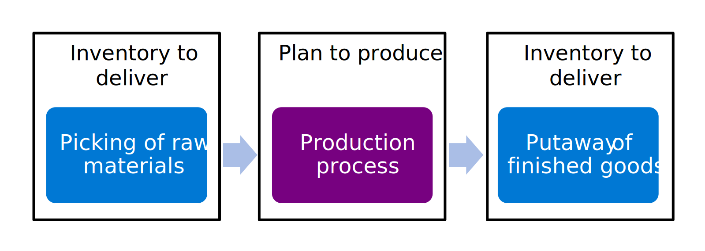
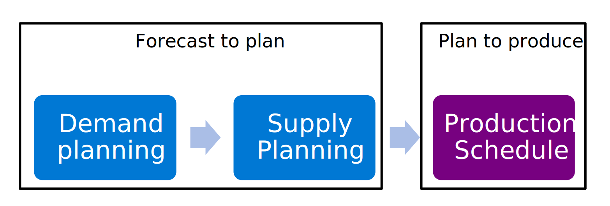

# Help organizations manage and optimize their plan to produce processes

***Applies to: Dynamics 365 Finance, Dynamics 365 Guides, Dynamics 365 Human Resources, Dynamics 365 Project Operations, Dynamics 365 Supply Chain Management, Dynamics 365 Business Central, Power Apps, Power BI, Power Automate***

This article introduces the *plan to produce* end-to-end business process. It outlines how Microsoft Business Applications can help organizations manage and optimize their *plan to produce* processes. This end-to-end business process has the number *70* in the business process catalog. Learn more at [About the business process catalog for Dynamics 365 apps](about.md).

## Plan to produce overview

The term *plan to produce* is used to describe a collection of business processes that an organization implements to support the planning and execution of the production process. Planning refers to the definition of production strategies, reviewing the long term production plan, and building a production schedule. The production business process incorporates the activities before, during, and after the execution of the procedures that result from taking raw materials and creating sub-assemblies or finished goods.

The *plan to produce* process covers several different approaches to manufacturing. For example, discrete manufacturing, process or batch manufacturing, lean manufacturing, and job-shop manufacturing. These are all considered different modes of manufacturing, but the core concepts in the business process are largely the same. <!--Learn more about how to use the Microsoft Business Applications tools for different modes of manufacturing in the business process and patterns documentation. Eva: No idea what this sentence is trying to say...-->

The *plan to produce* process is highly interconnected to the other end to end business processes, such as *forecast to plan*, *source to pay, inventory to deliver, record to report, order to cash, and acquire to dispose*. The upstream or downstream relationship of *plan to produce* to the other processes is highly dependent on the operational strategies of each organization. For example, *plan to produce* could be an upstream process of *order to cash* in a make-to-stock scenario, but would be a downstream process instead in a make to order scenario. Organizations also often use multiple different operational strategies when they offer different types of products. This choice is fully supported by Dynamics 365.

> [!NOTE]
> It is important to note that the inventory management processes related to *plan to produce* are not included in this process definition. They are located in the *inventory to deliver* process. Learn more at [Inventory to deliver - introduction to the end-to-end business process](inventory-to-deliver-introduction.md).  

> [!NOTE]
> It is important to note that the supply and demand planning process is part of the *forecast to plan* business process, and the planning in the *plan to produce* process begins with scheduling production. Learn more at [Forecast to plan introduction](forecast-to-plan-introduction.md).  

The high-level strategy for *plan to produce* processes should be planned at the early phases of a larger business solution. The design and decisions made about this process have an impact on downstream processes including integrations, data that must be migrated, and so on. The production process is often considered business-critical scope for implementing a technology solution, but may sometimes be slated for later phases when a finance-first implementation strategy is chosen.

Every organization has variations to the *plan to produce* process. Here, we define the basic outline for any organization looking to implement a Microsoft technology solution to support the *plan to produce* process.

## Effect

The *plan to produce* business process is key to any company that produces the product that they sell. A strong *plan to produce* process ensures that production runs efficiently within the capacity of materials and production resources to deliver products on time and at a minimized cost. Getting the *plan to produce* process right allows all other areas of the business to run smoothly and ultimately results in high customer satisfaction and brand loyalty.

Dynamics 365 includes many tools to support the execution and control of the *plan to produce* process. The core Dynamics 365 Supply Chain Management tool tracks production data like bills of materials and routings, supports production scheduling and capacity planning, and aligns the production process with other areas of the business. Power Apps can be used to make custom, quick, low-code solutions to support some of the more unique needs in your production process. Power BI and Azure Data Lake together can provide real-time visibility into shopfloor data and metrics to ensure that operations are receiving valuable feedback to control the quality and process of production.

## Stakeholders

The key stakeholders required to define the *plan to produce* business processes include:

- **Inventory stakeholders** – examples: Warehouse manager, Transportation planner

- **Customer service stakeholders** – examples: VP of Customer Service, Customer service director, Customer satisfaction manager, Call center manager

- **Planning stakeholders** – examples: COO, VP of Operations, Operations manager, Planning manager

- **Procurement stakeholders** – examples: Director of procurement, Buyer, Purchasing agent, Purchasing manager

- **Sales stakeholders** – examples: VP of Sales, Sales director, General manager

- **Production stakeholders** – examples: Production manager, Production scheduler

- **Engineering stakeholders** - examples: Product owner, Engineering manager

- **Costing stakeholders** - examples: Cost accountant, controller

## Plan to produce benefits

When your organization plans to implement Microsoft Business Applications to assist with the *plan to produce* process, there are several benefits the solution can help provide. These key benefits should be used to determine if the solution is a good fit for your business and to drive the specific business requirements for implementing the solution. As a side effect, these benefits can be used to create a baseline for your goals and objectives for the project so that you can measure the success of implementing solutions to meet those business requirements.

### Increase delivery date accuracy

Using Dynamics 365 Supply Chain Management to track and control the *plan to produce* process allows the business to accurately estimate customer delivery dates. The sales order entry process can reference current production operations and material and resource capacity to systemically calculate a realistic date when a customer order can be shipped, which ultimately increases customer satisfaction and improves the order on time and in full (OTIF) percentage.

### Improve insight into current production operations

Providing accurate status updates is as important as providing realistic estimates to customers. With the full operations traceability provided in Dynamics 365 Supply Chain Management, production supervisors and customer service representatives can quickly view the current status of shop floor operations to advise customers and internal stakeholders of order progress. Visibility into the procurement and planning operations can also provide production managers the tools they need to adjust the schedule based on supply chain disruptions or other variations.

### Quickly and efficiently scale operations

The organized and controlled approach to production data management in Dynamics 365 Supply Chain Management allows organizations to efficiently roll out new products and locations by using the engineering change control tools and product templates to streamline processes. The system also supports capturing standard sets of production instructions and sharing with operators either via a printed job sheet or through the shop floor interface.

### Enhance control of production costs and decrease cost variances

Dynamics 365 Supply Chain Management supports tracking production cost estimates and actuals for materials, labor, and overhead costs. Knowing the true cost of conversion in your production process helps ensure that you're properly setting product prices, and insights into cost variance can help identify opportunities for improving the production process.

### Optimize production schedule

By modeling your production process in Dynamics 365 Supply Chain Management, you can use tools like sequencing rules, substitution planning, and resource load allocation to create a production schedule that is optimized to reduce changeovers, meet operational requirements, and still supports on time order delivery.

### Improve quality control

Dynamics 365 enables manufacturers to track quality metrics throughout the production process, from raw materials to finished goods, ensuring consistent quality and reducing the risk of defects. It provides support for standardization of testing process and automating pass/fail assessments. It also ties in to the inventory management of quarantined materials and handling non-conformances and corrective actions.

## Learn more

If you want to implement Dynamics 365 solutions to assist with your *plan to produce* business processes, you can use the following resources and steps to learn more.

- Define the goals and objectives of implementing a *plan to produce* technology solution. Learn more at [Implementation strategy](../implementation-guide/implementation-strategy.md).

- Define the business process scope of your project. Learn more at [Process-focused solution](../implementation-guide/process-focused-solution.md).

- Request a demo or get a free trial of Dynamics 365 solutions for the *plan to produce* business process. Learn more at [Request a demo](https://www.microsoft.com/dynamics-365/free-trial).

- Learn more about the Power Platform products at [Business Application Platform](https://powerplatform.microsoft.com/)

- Get an overview of the *plan to produce* process. Learn more at [Plan to produce overview](plan-to-produce-overview.md).

## Next steps

If you want to implement Dynamics 365 solutions to help with your *track production costs* business processes, use the following resources and steps to learn more.

1. [Define product costing overview](design-to-retire-define-product-costing-overview.md)  

2. [Define production strategies](plan-to-produce-define-production-strategies.md)

3. [Plan production operations](plan-to-produce-plan-production-operations-overview.md)

4. [Run production operations overview](plan-to-produce-execute-production-operations-overview.md)

5. [Outsource production operations](plan-to-produce-track-production-costs-overview.md)

6. [Control production quality](plan-to-produce-control-production-quality-overview.md)

7. [Track production costs](plan-to-produce-track-production-costs-overview.md)

Return to the overview of business process areas at [Plan to produce business process areas](plan-to-produce-areas.md).

## Related information

You can use the following resources to learn more about the *plan to produce* process in Dynamics 365.

- TechTalk series on the plan to produce process: [Production control in Dynamics 365 Supply Chain Management](https://community.dynamics.com/blogs/post/?postid=5d421c52-1fb7-46b5-ae52-93db574cf3f6)

- TechTalk on Manufacturing Accounting: [Part 4: Manufacturing Accounting in Dynamics 365 Supply Chain Management](https://community.dynamics.com/blogs/post/?postid=3e44201b-72e9-4db2-99bb-13e03b3514ae)

- TechTalk on Production Variance Analysis: [Part 7: Production Variance Analysis in Dynamics 365 Supply Chain Management](https://community.dynamics.com/blogs/post/?postid=e9612de7-2e9f-45a4-af54-81b30dc11c55)

- Product documentation: [Production process overview - Supply Chain Management](/dynamics365/supply-chain/production-control/production-process-overview)

- Product training: [Get started with production control in Dynamics 365 Supply Chain Management](/training/modules/get-started-production-control-dyn365-supply-chain-mgmt/)

- Related product certification: [Exam MB-335: Microsoft Dynamics 365 Supply Chain Management Functional Consultant Expert (beta)](/certifications/exams/mb-335)

- Dynamics 365 Community Forum: [Dynamics 365 Supply Chain Management Forum - Production Control](https://community.dynamics.com/forums/thread/?discussionforumid=bd2c77d7-890b-4a36-87a4-8afbddbca6a6)

- Find definitions of terminology used in content for *plan to produce* in the [Glossary: Dynamics 365 business processes](glossary.md) article  

<!--## Tags
*Stakeholders:* Functional consultant, Business analyst, Cost accountant lead, Finance lead, Sales lead, Purchasing lead, Production lead, Supply chain lead

*Products:* Dynamics 365 Finance, Dynamics 365 Guides, Dynamics 365 Human Resources, Dynamics 365 Project Operations, Dynamics 365 Supply Chain Management, Dynamics 365 Business Central, Power Apps, Power BI, Power Automate
