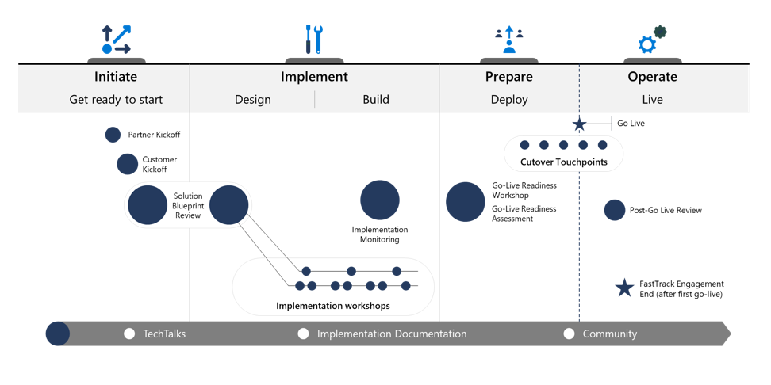

# Success by Design for Dynamics 365

Success by Design for Dynamics 365 systematically guides an implementation through a series of assessments at critical stages to ensure optimal architecture, security, performance, and user experience for a Dynamics 365 solution. The framework is designed around three core principles: 

- Early discovery
- Proactive guidance 
- Predictable success

The Success by Design framework spans four critical stages of the implementation journey: 

1. Initiate
   - Understand the breadth of the solution. Assess implementation partner readiness.
   - Determine the inputs and outputs expected of Microsoft. Guide directionally.
2. Implement
   - Dive deep into the design and provide specific guidance.
   - Apply and extract patterns and practices.
3. Prepare
   - Assess system and operational readiness for go-live.
   - Guide and monitor to ensure success.
4. Operate
   - Review customer outcome. Review lessons learned.
   - Compile customer evidence.

## More resources

- [Introduction to Succes by Design](/dynamics365/guidance/implementation-guide/success-by-design)  
- [Microsoft Dynamics 365 implementation guide](/dynamics365/guidance/implementation-guide/overview)  
- [Dynamics 365 implementation portal](/dynamics365/guidance/implementation-portal/overview)  
