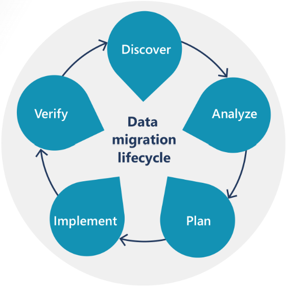
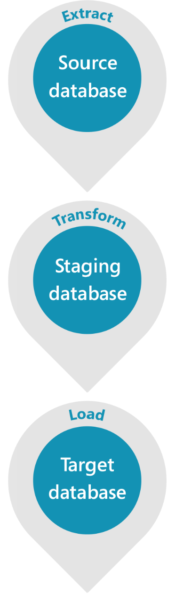

# Configuration data and data migration in Dynamics 365 implementation projects

Start the preparations for importing data to prepare for your Dynamics 365 solution to be ready for go-live once you've established a good understanding of your business requirements and have set up proper data governance.  

There are two types of data to think about:  

- Configuration data  
- Migrated data  

Managing these two data imports is often the most challenging part of Dynamics 365 implementations. We often see customers underestimating the efforts required and projects suffering as issues surface later. In this article, we talk about the following subjects:

- Plans for configurations  
- Plans for data migration  
- Different environments  
- Identifying data sources  
- ETL (Extract, Transform, Load) or ELT (Extract, Load, Transform) processes  
- Staffing the right resources who can manage these efforts  

## Configuration data

Configuration data is data about different setups needed to prepare your production environment for operational use, for example, currencies and tax codes. Besides importing master data like customers and products, you need to import configuration data. Managing configurations is an activity that needs to happen throughout the lifecycle of the implementation. As the team understands the business requirements and designs required, they understand different setups and parameters needed to enable the business processes required by the business.

Since the Dynamics 365 offerings are highly configurable, you need tight control over the different configurations required to be set. With so many development and testing environments and different team members, there's a high chance of incorrect configurations being set, leading to errors in processes. For Dynamics 365 Finance, Supply Chain Management, and Commerce, we recommend setting up a dedicated golden configuration environment to capture and maintain the correct configuration data. A gold environment can help ease the pain in tracking, storing, updating, and controlling the configuration data. Gold environment settings should be kept pristine, have tight access control, and no one should be allowed to create any transactions. You can use the golden configuration database to restore other environments for testing, data migration, and even initial go live.

### Use a configuration plan

Next, it's important to discuss the idea of using a configuration plan. It's especially important in a phased rollout scenario when you plan to set up many environments, legal entities, or business units.

You can use a golden configuration environment to restore into production for the first phase of go-live. But for every subsequent phase of go-lives, you don't have that luxury. The double whammy of a large number of setups and slight but crucial variations of each go-live can be highly daunting, so doing it manually is fraught with danger. We highly recommend that organizations use a configuration plan.

Configuration plans are a structured list of different master and configuration data that you want to import for go live and any subsequent go lives. It's organized in the sequence required by the system and manages the dependencies between entities. As an example, if you need to enable purchase orders you need vendors first, if you need projects, you need accounts first, etc.

This plan also represents the functional scope for the solution. As described in the [Process-focused solution](process-focused-solution.md) article, you start with your process definition and scope for the implementation. This process requires you to switch on functionality in the application. The  functionality requires configuration and master data and eventually some transactional data in connection to the first use of the application, such as opening balances. The configuration plan represents this scope in terms of system enablement and the correlation between all of them.

Another benefit of the configuration plan is how it provides early visibility of how those configurations and master data play a role between the different business units (legal entities) or apps that share the same database foundation. You can determine if that data is natively shared, or if it's unique for an entity. Having this visibility prevents you from having redundant data replication and improves the speed to enable the solution.

For example, flag the setups that only need to be imported once as they're shared across business units or legal entities. In contrast, there are setups that need to be imported for each phase as they aren't shared. A configuration plan can help you be organized and consider the requirements for all the subsequent business units or legal entities. Another example is using data-sharing features to copy configurations across companies instead of manually importing those configurations into each company in the solution.

The configuration plan is your configuration playbook. It shows the scope, dependencies, and data redundancy. It can also help you to track the progress of enabling the solution in terms of configurations and master data required to be loaded.

> [!TIP]
> Managing a configuration plan is an iterative process.  

As you make progress in the project and discover new requirements, come back to the plan and update it. The list is your one-stop shop to tell you what you are going to do for each go live for each configuration, what data is already available, and what data needs to be imported. Just like your golden configuration environment, it's crucial to keep your configuration plan up to date.

A proper well-maintained configuration plan makes sure the team considers all the important configurations for all the planned rollouts and doesn't miss them causing unwanted errors in production after go live.

This plan also helps the team be prepared for cutover. It calculates the required downtime window to import all necessary data. The team should test the configuration plan many times, note the time it takes for all the configurations, and confirm that the total time required is within the cutover window.

> [!IMPORTANT]
> We recommend that teams create a configuration plan to manage all their imports. The benefits of reduced errors and faster imports far outweigh the efforts needed to create and manage the plan.

Since the configuration plan is essentially a list, many customers prefer to use Excel sheets as most organizations are familiar with the program. There are also customers who prefer to maintain the list in DevOps. For example, you can have one work item for currencies and another work item for tax codes with exported data entities attached to the work items. It doesn't matter which option you choose, as long as your team members can access and update the list when necessary.

<!--Broken link, so removing sentence: Download a sample plan for managing configuration imports for Dynamics 365 Finance, Supply Chain Management, and Commerce from [Sample Configuration Plan using Data Entities](https://community.dynamics.com/cfs-filesystemfile/__key/communityserver-components-sitefiles/TechTalk+Presentation+Files/T2.5_2D00_SampleConfigurationPlanUsingDataEntities_2D00_DYN445PAL2.xlsx?_=637461855201343768).-->

## Data migration

The second type of data is migrated data. Data migration is the process of moving data from one data model to a different data model for future use. For Dynamics 365, data migration refers to moving data from a legacy system to a Dynamics 365 application. Both if the legacy system was another business application, and if it consisted of disparate Excel spreadsheets, you've captured data to run your business. You need that data when you move to your new Dynamics 365 application.

Migrated data is either master data such as customers, products, and vendors, or open transactions such as open sales orders, open purchase orders, stock on hand, and open balances.

### Migration planning

When deploying a solution, data is important. Different departments within the organization can find it challenging to support certain activities when there's no data in the system.

If the implementation project replaces another business application, relevant data is often migrated to the new system during the deployment. This way, users can see relevant business information when they start using the application. It's especially important to manage the timeline of data migration activities in the project plan so you can allocate time and people to the activities. For example, you need to track activities like migration planning, identifying data sources, data mapping, ETL process, importing data for UAT, and importing data for go live.

Explore the parts of the data migration lifecycle. Take time to **discover** the mandatory data required by your solution and **analyze** the data types and systems that source the data to be imported.

Migrating data is a time-consuming and expensive process. It often lacks full visibility and understanding of the use cases. The use cases help define how the data is used within your solutions processes.

When building a **plan**, keep in mind that data migration activities can be a disruptive task and shouldn't co-exist with other testing activities. We recommend that you procure a dedicated high tier data migration environment.

It's recommended to **implement** at least one round of system integration testing (SIT) and user acceptance testing (UAT) with migrated data. During testing, developers and users are able to **verify** the migrated data and ensure it meets the requirements.

### Defining a migration strategy

Data migration is a major undertaking. It's often run as a parallel activity to the development and testing activities, and it spans multiple phases. Several decisions must be made regarding the scope of the migration, environments, source databases, and the tools used to extract and transform.

There needs to be clear business requirements defining the data migration scope, timelines, and expected cutover plans before a project kickoff. You should raise concerns immediately if these details aren't clarified.

- The source for where the data needs to be pulled and migrated is identified.

- All the entities and their data volumes are documented

- Data migration and testing environments are provisioned and sized appropriately.

- There's a mapping document for the tables/fields between old and new systems

- Owners are defined for different aspects of migration; data cleansing, importing, validating etc.

- Data analysts and developers are resourced

- Pre cutover and post cutover data migration activities are planned properly. For example, time frames, entities, and volumes to migrate are captured for cutover.

### Multi-source data

The source data can come in all shapes and sizes. From a salesperson's Excel spreadsheet to a legacy systems SQL database. Knowing all the sources allows time to analyze the options for extracting the information.

- SQL database

- Third party database

- External webservices

- Access

- Flat files/Excel

In advance and during the project, we recommended that the LOB team begins the process of identifying, consolidating, deduping, scrubbing, and cleansing the data. The goal is to limit the amount of transformation needed during migration. The more logic required to transform, the slower the migration takes to load.

### Data volumes

Often the data volumes and their characteristics aren't clearly understood. The team needs a list of all the entities, tables, and volumes required to migrate. They also need characteristics such as the frequency of transfer, mode of transfer, peak volumes, and so on. Each interface should have the following characteristics defined at a minimum:

- Entity

- Direction relative to Dynamics 365 (from or to or both)

- Mode (full push or incremental)

- Volume (at a line level where applicable, example, sales lines)

- Frequency (hourly, daily, weekly)

- Interface pattern

Until all of the characteristics are defined, you can't assess if the appropriate tools are used to migrate data. You also can't tell if you've got the right integration patterns (such as ODATA), defined performance testing test cases, or considered error handling.

### Environments

Another missed factor is sizing of the import and staging databases required for running migration tooling and cleansing of data. Make sure the environments are sized appropriately to handle the volumes of data in scope. It's recommended practice to have all databases and environments running under the same location and region and with acceptable latency ([Azure Latency Test - Azure Speed Test](https://www.azurespeed.com/Azure/Latency)). During environment planning, source the appropriate environments for data migration.

### Data mapping

The process of data mapping can start once the solutions for data modeling have been defined. You should be organized to keep the process systematic and simple.

- Use an Excel spreadsheet with each tab representing a system table.

- Capture all the fields being mapped together along with any transformation requirements.

- Pay close attention to the target system you're loading data into. For example, data types should match between systems or be transformed accordingly.

### Extract, transform, load (ETL) tooling

Once you've identified the sources, set up the environments, and documented the data mappings, the logical next step is to **extract** the data from the source, **transform** the data for target, and **load** the data into the target, as illustrated below.

You can use many types of tools and approaches when migrating data to your Dynamics 365 solution. Some of the standard options include:

- Data import/export wizards

- Azure Data Factory or Azure Synapse Analytics

- SQL Server Integration Services (SSIS)

- Third-party integration products

Also, the data load sequence is important, and, in some cases, records will fail if not ordered in the correct sequence. Make sure that your references are defined and loaded in the correct order.

Refer to the product-specific section later in this article for a list of some of the most common options.

### Roles and responsibilities

Customers and partners should staff the project team with the right resources who understand data and the tools in Dynamics 365. The following table lists important roles and responsibilities.

| Role | Responsibility |
|--|--|
| Data migration analyst | Assists in designing, planning, and managing the data migration process. Works with subject matter experts and project teams to identify, define, collate, document, and communicate data migration requirements. |
| Data steward | Maintains data and manages it according to data properties as required by administration. Coordinates with stakeholders. Provides all definitions for data. |
| Data migration architect/developer | Designs and develops the environments required for migration. Develops data packages as required to move the data between systems. Provides initial testing and validation. |

## Next Steps

- Review Data Management product specific guidelines. Learn more at [Guidelines for customer engagement apps](data-management-product-specific-ce.md) and at [Guidelines for finance and operations apps](data-management-product-specific-fo.md).

- Access the checklist at [Data Management Success by Design checklist](data-management-check-list.md).
