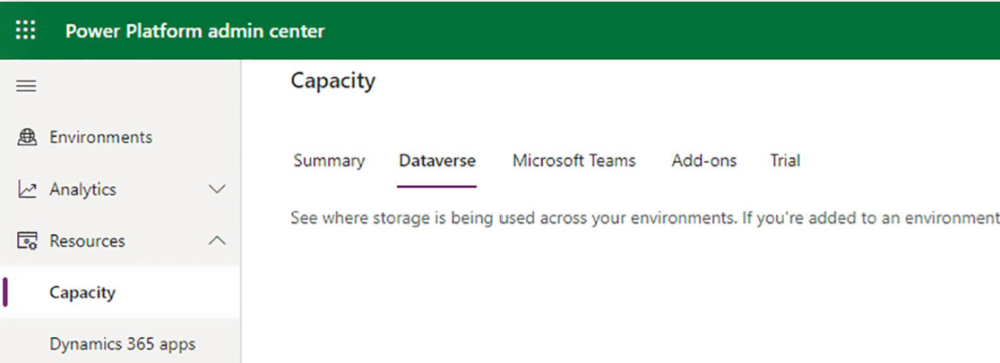

---
title:  Guidelines for customer engagement apps
description: Get recommendations and resources provided to help manage modeling, storage, migration and data archival for customer engagement apps in Dynamics 365 solutions. 
author: vaniaf
ms.author: vaniaf
ms.date: 03/30/2023
ms.topic: conceptual

---
# Guidelines for customer engagement apps and data management

Dynamics 365 spans lines of business and apps that are often used together. However, there are differences in toolings for how to manage data across the apps. This article highlights some of the approaches for the customer engagement apps.

This section includes several recommendations and resources to help manage modeling, storage, migration, and archive data.

## Data modeling

Data modeling is a science, and there are data modeling professionals and established standards for data modeling. To be effective with Dynamics 365 data modeling, you don't have to be a professional data modeler or use any special tools. Popular tools like Microsoft Visio can be used to quickly create a basic ERD diagram that visualizes the relationships and flow of data between tables. In this section, we discuss some general best practices for data modeling for Dynamics 365 deployments.

- Data models should be updated continuously during deployment. It's common for a data model to be designed at the beginning of a project, but it's important that it doesn't stop there. As you go through the deployment, new fields and tables are added. It's important to capture these changes in the data model to make it a living data model. We recommend that you continue to update it to enhance the system.

- Don't include every table. Some core tables, such as activities, notes, and users (record owners), are related to nearly every entity in Dynamics 365. If you include every relationship with these tables in your data model, the result is unreadable. The best practice is to include only the primary tables used in your configuration in your data model diagram and include only custom relationships with the user and activity tables to maximize readability.

- Data models should include tables outside of Dataverse.  

  Data from integrations with other systems through Dataverse data connectors or virtual tables should also be represented in your data model diagram. The same is true if data flows outside of the Dataverse via an integration.  

- Start simple with the standard tables, then add custom entity relationships to your data model.

- User experience should influence your data model. Sometimes it's easy to over normalize your data, but the process could make the application more cumbersome to use.

Start with what you need now, but design the data model in a way that supports what you are going to need in the future. For example, if you know that you'll eventually need to store more details about sales territories, don't use a text field for territory already now. It will make it more difficult to implement than if you use the territory entity relationship now. Plan for what is coming.

## Data storage

This section provides product-specific guidance you can use while implementing or maintaining your solution.

## Forecasting capacity

The capacity your environment consumes should be part of the overall environment strategy. Every environment should be assessed for storage requirements based on usage. For example, the development environment doesn't require as much storage as a production environment to operate.

First, you need to calculate the approximate volume and size of the data to properly come up with an estimate. You can gather this detail from your existing data sources. You should come up with a size either in megabytes (MB) or gigabytes (GB) needed in production.

Based on the estimated size for production, you then need to allocate a percentage for each environment. See the example below.  

|Environment  |Use  |Percentage of product  |
|---------|---------|---------|
|Production  |Contains all data required for go-live|100|
|Training|Contains a sample of the data|15|
|QA |Contains a sample of the data|15 |
|SIT  |Contains a sample of the data|15|
|Development|Contains limited data only|5|

The best practice is to build a data storage forecast for a minimum of three years, including an average increased annual volume. We recommend that you talk with your system integrator and Microsoft contacts when you design and configure your environments. Discuss the amount of storage you anticipate you need and when you need it by. The business needs to track the data growth to make sure the overall size stays within your allotted storage entitlements.

Environments should be managed with a well-planned environment strategy. For example, a developer shouldn't be able to go ahead and create new environments on the fly. Doing so could create opportunities to go over entitlements, which leads to enforcement, which in turn could limit your ability to deliver on the application lifecycle management (ALM) strategies.

Learn more at [Environment strategy](environment-strategy-overview.md) and [Application lifecycle management](application-lifecycle-management.md).

## Storage capacity

The storage capacity is a standard calculation in the Power Platform that the system administrator can manage easily. Use the [Power Platform admin center](https://admin.powerplatform.microsoft.com/) to maintain storage and consumption visibility. In the Power Platform admin center, go to **Resources** > **Capacity**, and then choose **Dataverse** for more details about environments capacity entitlements.  

## Storage entitlements

Dataverse capacity (database, file, log, and add-ons) is pooled across the tenant and shared among all environments and workloads. The first subscription provides a one-time default capacity entitlement for the tenant. [Learn more about the Dataverse storage capacity.](/power-platform/admin/capacity-storage)

## Storage segmentation

To better understand how capacity is calculated within Dynamics 365, see the breakout based on storage type and database tables in the following list.

- **Dataverse database**  

  All database tables are counted for your database except for logs and files below.

- **Dataverse files**  

  The following tables store data in file and database storage:

  - Attachment

  - AnnotationBase

  - Any custom or out-of-the-box entity that has fields of datatype file or image (full size)

  - Any table that is used by one or more installed Insights applications and [ends in "-analytics"](/power-platform/admin/capacity-storage#what-are-tables-ending-in---analytics-in-my-capacity-report)

  - AsyncOperation

  - Solution

  - WebResourceBase

  - RibbonClientMetadataBase

- **Dataverse logs**  

  The following tables are used:

  - AuditBase

  - PlugInTraceLogBase

## Data migration

This section provides product specific guidance you can use while implementing or maintaining your solution.

### Approaches and tools

You can use many types of tools when migrating data to your Dynamics 365 solution. We don't show a complete list here, but we cover some of the most common options.

- **Don't migrate data**  

  It's often assumed that you must migrate large amounts of data to Dynamics 365 to provide a complete view of the data. However, just because you need to see data in Dynamics 365 doesn't mean that the data must live in the Dynamics 365 Dataverse database. Consider the value of the data weighed against the quality of data, the volume of the data, the amount of time required to load the data, and potential storage costs before migrating data.  

  Often, you can replace data that you don't migrate with embedded Power BI reports, virtual entities, embedded canvas apps with connectors to the source data, and so on.  

  For example, the email auto-capture option in Dynamics 365 Sales Insights displays activities to salespeople from their Exchange inbox rather than having to load the data to Dynamics 365. That's a viable option to show activity data rather than loading large amounts of data. Virtually displaying data can also significantly reduce the time and cost of deployment, as you don't have to take time to load data and test your data migration.

- **Power Apps Excel add-in**  

  This add-in can be used to open entities directly in Excel and create and update records. Records are updated or created directly in Dataverse. Not all entities support updates from Excel, and lookup fields must be manually edited to correctly match.

- **Get data from Excel**  

  At [make.powerapps.com](https://make.powerapps.com/), view an entity, and then choose **Get data** to import data from an Excel or .csv file. This option gives more control over the mapping of data than the Excel add-in. You can import data from one file into multiple entities. To help ensure that the format of fields and mapping is correct, export a template from a Dataverse entity, populate your data, then import it. Alternatively, import a custom file and provide mapping. Lookup fields must include the primary key or entity alternate key values to match correctly.

- **Power Platform dataflows**  

  At [make.powerapps.com](https://make.powerapps.com/), you can select **Dataflows** from the **Data** menu and configure an import from several data sources. Data sources include common external services file sources and generic web APIs. Data from these data sources can be transformed prior to import using Power Query.

- **Legacy Dynamics 365 data import utility**  

  You can import data to Dynamics 365 entities from CSV, .xls, .xml, and .zip. While the Dataverse API `Get Data` option is recommended for most flat file imports, the legacy data import option has several unique capabilities that might be useful in some cases.

  - Legacy data import can be used to create new entities, fields, and option set values in Dynamics 365. While it's convenient, it's a best practice to add these items from a solution rather than from data import.

  - Legacy data import can import multiple files at the same time when multiple files are added to a zip file.

  - Legacy data import can resolve lookup fields using values not contained in the primary or alternate keys.

- **Dynamics 365 Configuration Data Migration Utility**  

  This tool is designed to move data between Dynamics 365 environments. If you're migrating data from sandbox environments to production, it's useful to keep the record IDs consistent between environments. Consider the tool when you have entities like country/region and specific records are referenced in workflows or flows. In such cases, the process doesn't work if the ID changes between environments. Configuration Data Migration Utility was updated in early 2020, so you can now provide filters to tailor the records included in the Configuration Data Migration Utility data packages.

- **Extract, transform, and load (ETL) software**  

  For more complex migrations, such as migrating an entire legacy CRM environment's data, manual import from flat files isn't efficient and can be error prone. For more complex migrations, commercially available ETL tools like SSIS, Azure Data Factory, or many third-party ISPs offer services and tools that can be used to create a migration data transformation specification (DTS) that can migrate legacy data to Dynamics 365. This approach can have the following benefits:

  - Reusability of migration, allowing the data migration developer to test and refine the migration multiple times before go live.

  - Delta sync loads when moving the data from an in-production system to a new system. Users still use the legacy system until the switchover to Dynamics 365 happens. If the data is loaded into production several days before go live, there's more data created in the legacy system after the initial load is finished. ETL tools can filter the data loaded to only include data changed since the latest load. This way, you're sure that the migrated data is up to date when the users start using the new system.

  - Consistency with data integration  
  
    Sometimes data is migrated in an initial load, and then updated via an ongoing integration. In these cases, it's optimal to use the same tooling that you use for the ongoing integration to also migrate the initial data load. In such cases, the same DTS and field mappings may be used for the data migration as well.

  - More complex data transformation  

    When you move data in flat files, you can choose what data is mapped to the new system. But if you want to change or transform the data, you must do so manually in the source flat files. With an ETL based migration, you have flexibility to transform the data during the migration. For example, say there are five different types of accounts in the source data, but you wish to consolidate them to three, ETL tools allow for this transformation in the data translation specification.

  - Updates and upserts  

    The flat file and Excel imports support updating records that match record keys, but sometimes your matching logic is much more complex. Say you want to both update and insert records (upsert). it's complex and tedious to do with the out-of-the-box data import options, as you don't always have the record IDs. With ETL tools, the data migration developer can define record matching logic and update, insert, or upsert records based on any matching criteria. This is also helpful for making sure that duplicate records aren't being created in the target.

  - More flexibility in mapping lookup fields. Lookups to other entities can be challenging for data imports, especially fields that are polymorphic, such as *customer*, or fields that have special properties, such as *owner*. If your legacy data has owning users that have a different format, the ETL tool can transform the values into a format that can be imported.

  - Many-to-many (N:N) relationships. ETL based imports can easily import data to N:N relationships and entities like marketing list member, which isn't available from some of the flat file import options.

  - Faster import of large data sets. Good ETL tools can use multi-threading to import data quickly into Microsoft Dataverse.

- **Power Automate and Azure Logic apps**  

  Use Power Automate and Azure Logic apps to import data and provide connectors to over 300 services. These options provide many of the same benefits as an ETL tool. Power Automate includes more than 300 connectors to leading services and application platforms, and it's a great option to migrate data from these services. Although we have these options, they aren't meant to perform large data migration jobs. Instead, think of them as a great option for low-volume or low-rate delta migrations that aren't too demanding on throughput.

- **Custom API migrations**  

  This option gives you more control over migration and doesn't require any extra tools, but it requires that you have a developer to develop and support the data migration.

## References

[Data Management/Data Warehousing information, news and tips - SearchDataManagement (techtarget.com)](https://searchdatamanagement.techtarget.com/)

[Insights-Driven Businesses Set The Pace For Global Growth (forrester.com)](https://www.forrester.com/report/InsightsDriven+Businesses+Set+The+Pace+For+Global+Growth/-/E-RES130848)

[DMBoK - Data Management Body of Knowledge (dama.org)](https://www.dama.org/cpages/body-of-knowledge)

## Next Steps

- Review Data Management product specific guidelines. Learn more at [Guidelines for finance and operations apps](data-management-product-specific-fo.md).

- Access the checklist at [Data Management Success by Design checklist](data-management-check-list.md).
