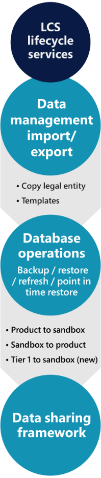

---
title: Guidelines for finance and operations apps and data management
description: This chapter includes recommendations and resources provided for Operations. We examine the various data management tool sets and data maintenance cleanup schedules. 
author: vaniaf
ms.author: vaniaf
ms.date: 03/29/2023
ms.topic: conceptual

---
# Guidelines for finance and operations apps and data management

Dynamics 365 Finance, Supply Chain Management, and Commerce have data management tools and data maintenance cleanup schedules, which we describe in this article.

## Data maintenance

When it comes to data storage, it's important to consider that not all data needs storing. You have lots of logs and staging data generated that can be safely truncated after a certain time. You need to set up a plan for data maintenance.

In Dynamics 365 Finance, Supply Chain Management, and Commerce, cleanup routines are available across various modules, which can keep the tables tidy. It's important to note that these cleanup routines should be completed only after detailed analysis and confirmation from the business that this data is no longer needed. Always test each routine in a test environment prior to running it in production. This article provides an overview on what is available today: [Cleanup routines in Dynamics 365 for Finance and Operations](/archive/blogs/axsa/cleanup-routines-in-dynamics-365-for-finance-and-operations).

### Best practices with handling personal data

- Avoid storing unnecessary personal data in Dynamics 365 Finance and Supply Chain Management.

- Identify, tag, and classify personal data that you need to store.

- The Dynamics 365 Finance, Supply Chain Management, and Commerce apps use Azure SQL database that allows data encryption at rest and transport.

- X++ APIs/patterns to encrypt and decrypt data at columns level for added security.

- Build Microsoft Edge applications/integration to help store and mitigate data residency and requirements for personal data.

## Data management toolsets

For solutions with Dynamics 365 Finance, Supply Chain Management, and Commerce, Microsoft provides a rich toolset and processes to support data movement and migration requirements. Use the features in the apps and Dynamics 365 Lifecycle Services to combine different approaches. The figure below highlights the options.

### Data management workspace

For solutions with Dynamics 365 Finance, Supply Chain Management, and Commerce, first and foremost is the data management framework. The framework is the primary tool, and you access it through the data management workspace.

Here you have an administrator managing all data-related activities through data projects using concepts like data entities, data templates, and data packages.

You can use this workspace to run many data-related scenarios like copying configurations between environments or loading data as part of data migration.

Learn more at the following links:

- [Data entities overview](/dynamics365/fin-ops-core/dev-itpro/data-entities/data-entities)

- [Configuration data projects](/dynamics365/fin-ops-core/dev-itpro/data-entities/configuration-data-projects)

- [Configuration data templates](/dynamics365/fin-ops-core/dev-itpro/data-entities/configuration-data-templates)

- [Configuration data packages](/dynamics365/fin-ops-core/dev-itpro/data-entities/configuration-data-packages)

### Database operations

Though you can use data entities and data packages to move small configurations, it's not always practical. You may often find it handy to move entire databases.

Database movement operations are a suite of self-service actions that you can use as part of data application lifecycle management (DataALM). These actions provide structured processes for common implementation scenarios such as the following list:

- Golden configuration promotion  
- Debugging/diagnostics  
- Destructive testing  
- General refresh for training purposes  

You can use database movement operations to perform refresh, export, import, and point-in-time restore. For example, once your golden configuration environment is ready, and you've completed all testing cycles and signed off in SIT and UAT, choose the **Sandbox to Production** database request to restore this database to production for go-live.

Learn more at the following links:

- [Database movement operations home page](/dynamics365/fin-ops-core/dev-itpro/database/dbmovement-operations)

- [Submit service requests to the Dynamics 365 Service Engineering team](/dynamics365/fin-ops-core/dev-itpro/lifecycle-services/submit-request-dynamics-service-engineering-team)

### Data sharing framework

Cross-company sharing is a mechanism for sharing reference and group data among companies in a Dynamics 365 Finance, Supply Chain Management, and Commerce deployment.

With this framework, you can share setups and master data across multiple legal entities. It makes it easier to manage master data when you're dealing with multiple legal entities and want to designate one legal entity as master for some setups and parameters data. For example, tax codes may not change from company to company. So you set them up in one legal entity, and then you use the cross-company data sharing framework and its policies to replicate the data across the rest of the legal entities.

Learn more at [Cross-company data sharing](/dynamics365/fin-ops-core/dev-itpro/sysadmin/cross-company-data-sharing).

### Copy company configuration in an existing environment

If the deployment is a phased rollout involving multiple companies in one Dynamics 365 instance, it probably makes sense to use the **Copy into legal entity** feature. You can designate one base company as the source template from which you can seed multiple other companies or legal entities. All the setups are automatically copied into those destination companies. This way, you can templatize your rollouts so that you can quickly create and set up new companies. This strategy needs some upfront planning and efforts in doing the setups. Depending on the scale of a company's rollouts, it can be an effective strategy savings time and reducing errors.

Learn more at [Copy configuration data between companies or legal entities overview](/dynamics365/fin-ops-core/dev-itpro/data-entities/copy-configuration).

## References

[Data Management/Data Warehousing information, news and tips - SearchDataManagement (techtarget.com)](https://searchdatamanagement.techtarget.com/)

[Insights-Driven Businesses Set The Pace For Global Growth (forrester.com)](https://www.forrester.com/report/InsightsDriven+Businesses+Set+The+Pace+For+Global+Growth/-/E-RES130848)

[DMBoK - Data Management Body of Knowledge (dama.org)](https://www.dama.org/cpages/body-of-knowledge)

## Next Steps

- Access the checklist at [Data Management Success by Design checklist](data-management-check-list.md).
