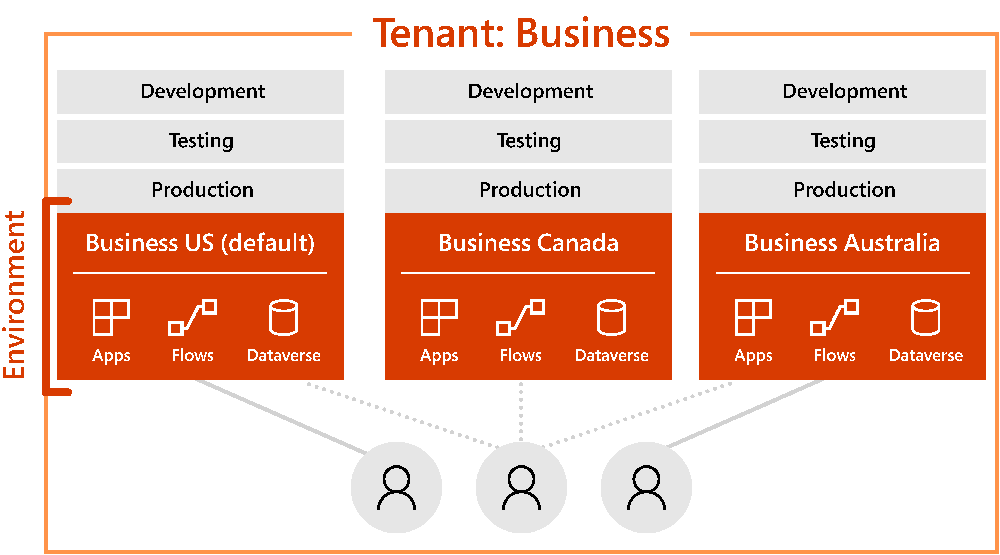
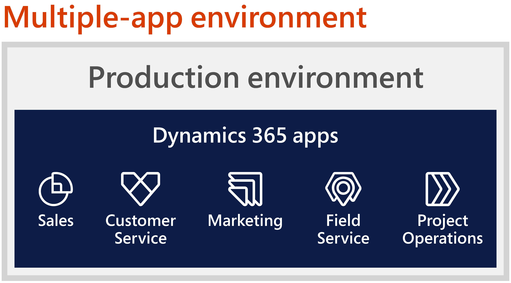
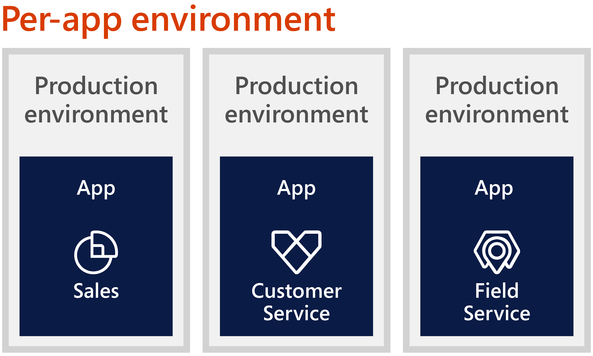

# Product-specific guidance

Most concepts related to environment strategy are product-agnostic and apply to most cloud deployments. In this article, we offer some guidance specific to the finance and operations apps or to the customer engagement apps and Power Platform.

## Product-specific guidance: Finance and operations apps

Finance and operations apps include Dynamics 365 Finance, Dynamics 365 Supply Chain Management, Dynamics 365 Project Operations, and Dynamics 365 Commerce. Implementation projects with these apps require environments to develop, test, train, and configure before production. There are different tiers for such nonproduction environments with pre-defined sizing, topologies, and costs. Understanding these basics is key to charting out a well-designed environment plan.

### Environments and project complexity

When you buy the Finance, Supply Chain Management, Project Operations and Commerce apps from Microsoft, you get two environments. One is the production environment, which is where your company business will be conducted. It's a robust environment, with high availability (HA) and disaster recovery (DR) capabilities.

In addition to the production environment, you'll receive one sandbox environment that's a standard acceptance testing (tier 2) instance for the life of the tenant. It's a nonproduction, multibox instance that can be used for testing, UAT, integration, and training needs.

(Because it's a basic tier 2 instance, it may not be enough for every type of testing. For example, performance testing needs a bigger instance to handle larger data volumes and more users.)

Depending on the project complexity, these environments may not be sufficient, as illustrated in this sample chart comparing the other requirements of two projects.

| Environment purpose | Finance and operations | Dataverse | Standard subscription | Less complex project | More complex project |
| --- | --- | --- | --- | --- | --- |
| Testing or Training | 2 | Sandbox |   |   |   |
| Production | Sized | Production |   |   |   |
| Development | 1 | Development | |   |  
| Build | 1 | n/a |  |  |  |
| Golden configuration | 1 or 2 | n/a | |  |  |
| Data migration | 2+ | n/a | |  |   |
| Performance testing | 4 or 5 | Sandbox | |   |   |
| Training | 2 or 3 | Sandbox | | |   |
| System integration testing | 2 or 3 | Sandbox | | |   |
| Other/ unplanned | n/a | Trial or Sandbox | | |   |

 Finance and operations environment  Dataverse environment

For less complex projects, you can use the out-of-the-box tier 2 instance for testing. You still need to consider development environments for development activities, with one development environment per developer. These environments have Microsoft Visual Studio installed.

You should also think about the build environment. Source code developed in the development environment is synched to Azure DevOps. The build process will use the build environment, which is a tier 1, to produce code packages that can be applied to sandbox and production.

Alternatively, you can use Microsoft-hosted build agents to do the builds instead of having a dedicated build environment. The limitation of this approach is that you can't run unit tests, and there's an overall time limit per month. Assess the limitation and decide whether you need a dedicated build environment.

Next is the "[Golden configuration](/dynamics365/fin-ops-core/dev-itpro/database/dbmovement-scenario-goldenconfig)" environment, for configurations that are fully tested and that you want to retain and transfer to other sandboxes and production environments.

You can consider a data-migration environment to move data from legacy systems, and a performance-testing environment. For performance testing, you'll want to use a higher tier (4 or 5) environment.

When it comes to more complex projects, you may need more environments. For example, you may wish to conduct testing in parallel if multiple teams are developing and testing parallel workstreams.

#### Lifecycle Services

For Dynamics 365 Finance, Supply Chain Management, and Commerce, all environments are contained in one project on the Microsoft Dynamics 365 Lifecycle Services portal. This Dynamics 365 Lifecycle Services project is hosted on one Microsoft Entra ID tenant, and includes all the environments used in the implementation, testing, and for going live, such as the production environment.

[!INCLUDE [azure-ad-to-microsoft-entra-id](~/../shared-content/shared/azure-ad-to-microsoft-entra-id.md)]

Typically, an implementation project has only one production environment, as such one Dynamics 365 Lifecycle Services project for each Microsoft Entra ID tenant. In rare cases, an organization may decide to have multiple production environments and have [multiple Dynamics 365 Lifecycle Services projects](/dynamics365/fin-ops-core/fin-ops/get-started/implement-multiple-projects-aad-tenant) as a result. You'll want to have more than one Dynamics 365 Lifecycle Services project or instance when one instance doesn't meet a global implementation's requirements for data residency, latency, or data volume. Another case is when different business units are implementing the product separately as independent applications.

Each Dynamics 365 Lifecycle Services project must meet the minimum licensing requirement. The project team must distribute the total licenses at the tenant level towards the individual Dynamics 365 Lifecycle Services projects, ensuring that the number of licenses assigned across all projects doesn't exceed the total license count purchased. To do so, after the allocation has been determined, open the [Subscription estimator](/dynamics365/fin-ops-core/dev-itpro/lifecycle-services/subscription-estimator) tool for each implementation project, and edit the active subscription estimate to apply the desired license allocation for that project. Multiple Dynamics 365 Lifecycle Services projects can be created as a [self-service activity](/dynamics365/fin-ops-core/dev-itpro/get-started/implement-multiple-projects-aad-tenant?toc=%2Fdynamics365%2Ffinance%2Ftoc.json).

#### Production environment and go-live assessment

When you're [preparing to go live](/dynamics365/fin-ops-core/fin-ops/imp-lifecycle/prepare-go-live), the first thing you need is access to your production environment. Project-wise, a production environment is deployed after all customizations are code-complete, UAT is finished, the customer has signed off, and there are no blocking issues.

For a Finance, Supply Chain Management, and Commerce project, you won't have access to this environment on day one, as Microsoft needs to complete few prerequisites, including a go-live assessment, before we can release the production environment.

In a go-live assessment, a solution architect is assigned to review the project and provide an assessment of potential risks, best practices, and recommendations for a successful go-live. The solution architect might highlight risk factors and ask for a mitigation plan. When the assessment is completed, the solution architect will indicate that you're ready to request the production environment in Dynamics 365 Lifecycle Services.

> [!IMPORTANT]
> Please note that the production environment is used exclusively for running your business operations and shouldn't be used for testing. More, the production environment is not available until the go-live assessment is finalized, a stage in which most of the testing should already be complete. You will be able to perform the cutover and, if planned, "mock" the cutover in production.

### General recommendations

- Plan for environments early in the project due to the impact on the project's budget. Consider the lead time needed to purchase the environment due to the impact on the project timeline. Revisit the plan at regular intervals.

- Define a consistent naming standard for your environments. For example, a gold environment should have "gold" in the name.

- Have a regular schedule to deploy updates and import fresh data (if needed).

- Keep all environments in the same region if your business is in one region. For example, avoid having a test environment in one geographical location and production in another.

- Deploy environments by using an unnamed account, such as `dynadmin@your\_organization\_name.com`. Assign the environments to an owner who will be responsible for their status and maintenance. We strongly recommend using the same dedicated admin account on all environments.

### Test environments

- Consider the number of testing environments you'll need throughout the project. A lack of environments may prevent planned concurrent testing activities from taking place and delay the project.

### Training environments

- Make sure all users have access with appropriate roles and permissions, which should be the same roles and permissions they'll have in production.

- Plan for downtime and have a communication plan to alert users. (Zero downtime is the eventual goal.)

- Ensure all integrations are set up and working, so users can experience the end-to-end cycle of a business process.

### Gold environment

- Make sure no transactions happen in a gold environment. There should be a process to bring tested configurations into the gold environment.

### Data-migration environments

- Assess whether you need a dedicated environment for data migration, which is a disruptive task that can't generally coexist with other types of test activities. Multiple data-migration environments may be needed to avoid conflicts if multiple parties are migrating data concurrently.

- Account for data-migration performance in environment planning. Depending on the size of the data-migration task, it may be necessary to use a tier 3 or higher environment to perform data-migration testing.

### Pre-production environments

- Assess whether there's a need for a separate environment to test code or configuration changes before they're applied to production.

- If there will be continuing development of the solution after you go live, you may need a separate pre-production environment to support concurrent hotfix and hotfix test activities. (This environment should have the same code base and data as production, so a like-for-like comparison can be performed for any new changes before they're applied to production.)

### Performance-testing environments

- Plan a specific environment for performance testing, or you won't be able to do performance testing activities in parallel with other test activities.

- A cloud-hosted environment shouldn't be used for performance testing.

- Avoid doing performance testing in the production environment or lower tier environments.

- Use of tier 2 or 3 environments typically won't provide the resources required to perform a performance test.

- Limitations on the number of threads and database resources available in these environments won't allow for modeling of most concurrent workload profiles.

### Developer environments

- Ensure each developer has an independent development environment.

### Production environment

- If not available through self-service actions, raise production environment requests through support, as you don't have direct access to this environment.

## Product-specific guidance: Customer engagement apps

Now we're going to focus on product-specific resources that apply to [Power Platform](/power-platform/admin/admin-mode) and [customer-engagement apps](/power-platform/admin/manage-apps).

### Environments and Dataverse in Power Platform

For each [environment](/power-platform/admin/environments-overview) created under a Microsoft Entra ID tenant, its resources can only be accessed by users within that tenant. An environment is also bound to a geographic location, such as the United States. When you create an app in an environment, that app is routed only to datacenters in that geographic location. Any items that you create in that environment, including connections, gateways, and flows using [Power Automate](/power-automate/getting-started), are also bound to their environment's location. Every environment can have one [Microsoft Dataverse](/powerapps/maker/common-data-service/data-platform-intro) database, which provides storage for your apps.  

:::image type="content" source="media/environments-dataverse-tenant.svg" alt-text="Organization chart under Microsoft Entra ID tenant, Contoso Corp, with three environments that contain a Dataverse database each." lightbox="media/environments-dataverse-tenant.svg":::

In this example, Contoso Corp has chosen to have a production environment for each geography where they have a legal entity. Each production environment then contains a Dataverse instance and the apps that employees of that legal entity need. User D is the only employee that has access to all three production environments.
<!--  -->

### Dynamics 365 products and Power Apps

Microsoft business applications are a set of intelligent solutions that supply a comprehensive view of an organization's business. These solutions include the [Dynamics 365 products](https://dynamics.microsoft.com/what-is-dynamics365/) that are connected by data and intelligence and supported by the Power Platform.

Dynamics 365 and Power Platform provide CRM and ERP capabilities and make it easier to create apps and share data across all Dynamics 365 applications. The combination also creates a set of purpose-built intelligent apps to connect front office and back office functions through shared data. Rich analytical capabilities provide organizations with deep insights into each functional area of their business.  

[Power Apps](/powerapps/powerapps-overview) is a suite of apps, services, connectors, and a data platform that provides an app-development environment where you can quickly build custom business apps that connect to your business data stored in either the underlying data platform (Dataverse) or online and on-premises data sources.

Customer-engagement apps such as [Sales](/dynamics365/sales/) and [Customer Service](/dynamics365/customer-service) are first-party Power Apps developed by Microsoft.

### Environment app strategy

If you're deploying multiple business apps on the Dynamics 365 platform, you'll need to decide on an environment app strategy. Should all apps be deployed in the same environment? Or should each app have an environment of its own?

The data store for an application and the supporting business process plays a key role in the environment decision. If multiple apps for different departments can benefit from using each other's data, a single environment with integrations can improve consistency and collaboration. The user experience can be tailored via dedicated apps for different personas and secure data access using the security model.

Environment policies shouldn't be created in isolation. If you don't consider the business requirements or understanding the underlying data and integration dependencies, it might lead to  unnecessary complexity and fragmentation if you create a generic organization-wide policy, such as "Every application should use a separate environment" or "All applications should share a single environment".

For sophisticated systems that need to use multiple environments and potentially sync data between them, it could be technically possible, but such patterns require careful consideration of performance and API capacity and are best avoided.

There isn't a standard answer or blanket approach that will work for all apps within your organization. The best approach for you is the one that facilitates collaboration and cross-pollination of information between apps, while also reducing data silos and meeting your organization's security, compliance, and data protection requirements.

### Multiple-app environment

In a multiple-app environment scenario, a single production environment is used for multiple apps. For example, the production environment might have the Dynamics 365 Sales and Customer Insights - Journeys apps to enable collaboration between the marketing and sales teams, and facilitate a quick transfer of qualified leads to sales representatives. Similarly, having the Sales and Customer Service apps in the same environment gives the sales team insights into customer support experiences, which could affect ongoing deals.

:::image type="content" source="media/environments-multi-app.svg" alt-text="Diagram with production environment for Contoso and bubbles with the names of five Dynamics 365 apps." lightbox="media/environments-multi-app.svg":::
<!--  -->

With multiple-app deployment, the app data, security models, and data models are in a common repository, allowing the apps to reuse any integrations. The security model design will be used to limit access to data for each app, with the user experience defined by the individual app. For example, the Sales and Customer Insights apps might use the same lead table, but security roles and the app definition will control access to records, fields, and processes.

Let's examine some of the pros and cons for the multiple-app deployment model.

#### Pros of a multiple-app deployment model

- It enables stronger collaboration between business teams by decreasing data silos.

- It reduces the number of environments to manage, and the amount of effort needed for platform updates.

- It allows reuse of integrations, and its simpler design lowers API consumption while avoiding the need for data sync across environments.

- It simplifies reporting and the business intelligence architecture.

#### Cons of a multiple-app deployment model

- Its security model could become complex, depending on access restrictions.

- Its ALM and release process needs to be coordinated for each app and will require full regression testing when changing shared components, making automation testing even more critical.

- Its capacity utilization for individual apps is more difficult to track.

- Its security, data models, or integrations, if poorly designed on one app, can affect other apps.

- It might have limitations on deploying several apps of the same type in a single environment. (For example, you can't have several Power Apps portals with the same template in a single environment.)

- It can't be used if you need to segregate the environments for a globally distributed user base due to performance, compliance regulations, or process differences.

### Per-app environment

In a per-app deployment model, every application gets its own production environment, with a separate set of environments to support the underlying ALM and release process. There's complete isolation of the data, schema, and security model. A per-app environment might seem simpler from a deployment perspective, but it can create data silos such that one business process can't easily benefit from sharing information with another, leading to extra effort in building complex integrations.

The following diagram illustrates Contoso's choice to have three production environments and install a single Dynamics 365 app in each of them.  

:::image type="content" source="media/environments-single-app.svg" alt-text="Diagram with three production environments for Contoso and a single Dynamics 365 app listed for each environment." lightbox="media/environments-single-app.svg":::
<!--  -->

Also, the security model is defined for each environment. You can't use the platform security constructs to define which data from one environment will be accessible to a user in a different environment.

Consider an example where the Sales and Customer Service apps are deployed in separate environments, but core customer records must be synchronized across the two. To provide sales representatives with visibility into support experiences will require some level of integration, either by copying over the data periodically or integrating the visual user interface (UI).

This approach might be more relevant for isolated functions within an organization where there's little need for data sharing and collaboration. For example, an internal HR ticketing system for employees has little to do with the sales process. Network latency, compliance, and region-specific requirements could mandate the use of per-app environments, but will introduce data-replication challenges, integration redundancy, and increased costs for storage, integration, and maintainability.

Let's examine some of the pros and cons for the per-app deployment model.

#### Pros of a per-app deployment model

- Its security model is separately managed for each app, which simplifies configuration when there's no need for data sharing between environments or development of custom security components.

- Its ALM and release process for each app can be independent.

- Its capacity utilization for individual apps can be tracked easily for cross-charging within the business.

- Its design issues in one app won't directly affect other apps.

- It's the preferred approach if there's a need to segregate the environments for a globally distributed user base due to network latency, compliance regulations, or process differences.

#### Cons of a per-app deployment model

- It can create data silos between business units and departments, potentially reducing collaboration and value to the business.

- It means a linear increase in the number of environments to support ALM for each app and the administration effort for platform updates.

- It largely prevents reuse of integrations and is a potentially complex solution requiring data sync and complex custom security logic. In some cases, integrations aren't possible across several environments. (For example, you can't sync users' Exchange mailboxes to several environments at the same time.)

- It potentially brings higher API and storage costs due to data and integration redundancy.

- Its reporting and intelligence architecture will be more complex and require data unification in an external data store, such as a data lake.

### Administration and governance

The [Power Platform admin center](https://admin.powerplatform.microsoft.com/) provides a unified portal for administrators to [create and manage environments](/power-platform/admin/create-environment), including [sandbox environments](/power-platform/admin/sandbox-environments), [backing up and restoring environments](/power-platform/admin/backup-restore-environments), and [copying an environment](/power-platform/admin/copy-environment). Admins can also manage settings for Power Apps and Power Automate.

The [Microsoft Power Platform Center of Excellence (CoE) Starter Kit](/power-platform/guidance/coe/starter-kit) is a collection of components and tools to help you get started with developing a strategy for adopting and [administrating](/power-platform/admin/admin-documentation) the Power Platform.

## Next steps

- Review recommendations for Azure Active Directory at [Tenant strategy](environment-strategy-tenant-strategy.md)  
- Find a checklist at [Environment strategy checklist](environment-strategy-checklist.md)  
- Get an overview at [Environment strategy](environment-strategy-overview.md)  
