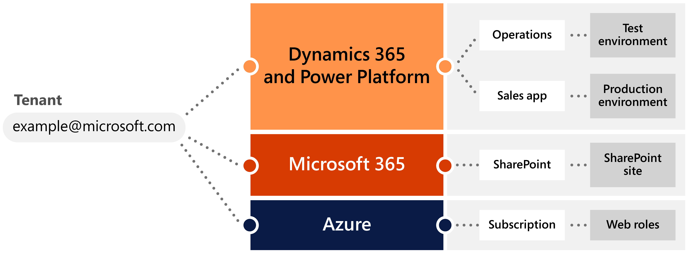

# Tenant strategy

To define the right tenant strategy for your organization, you should understand the controls that are available for each service to isolate code, configuration, data, and users. In this article, we use the term *tenant* for the organization's Microsoft Entra ID tenant, which is a prerequisite for Dynamics 365 solutions.  

> [!IMPORTANT]
> The isolation provided by services doesn't necessarily reflect the underlying infrastructure or design of a cloud service. A separate tenant doesn't mean it's a separate server farm, and having a separate environment doesn't give you a different front end.

[!INCLUDE [azure-ad-to-microsoft-entra-id](~/../shared-content/shared/azure-ad-to-microsoft-entra-id.md)]

Isolation approaches also may differ between services. For example, as shown below, you could have different subscriptions in Azure within the same tenant, and each subscription could host different applications and have a different set of users, because Dynamics 365 and the Microsoft Power Platform have environments that isolate data and manage user access.

A tenant provides the highest level of isolation for a cloud service, as it represents an organization and differentiates one customer from another. Tenants never share resources or licenses because they're meant to represent an organization and not a department or business unit. (In some cases, subsidiaries could share a tenant with the parent organization, depending on the organization structure, and the tenant model might mirror that structure.)

## Global single-tenant setup

Using a single Microsoft tenant to represent the organization in the Microsoft cloud <!-- Missing picture (Figure 9-3) --> is a common setup. It provides unified administration for user access and licenses, enables seamless integration between services, and lets the organization share tenant resources.

All Dynamics 365 and Power Platform environments will be a part of the same tenant. There could be different apps deployed in different environments, or they could have different users for each app and environment, but all would belong to the same Microsoft Entra ID that is associated at the tenant level. Using the Multi-Geo setup, you could create production environments in different countries or regions to meet your compliance and application needs, but they would remain a part of the same organization-wide tenant. Sovereign cloud deployment requires a separate Microsoft Entra ID and might have additional regulatory restrictions that limit your ability to create environments in different countries or regions.

Let's examine some of the pros and cons for a global single-tenant setup.

### Pros of a global single-tenant setup

- It aligns to the concept of tenant and the way cloud products are licensed.

- It allows sharing of licenses and quotas across the tenant per service. (Microsoft Dataverse storage is one such example.)

- It provides a central place for IT admins to manage the services, users, and licenses.

- It is easier to deploy organization-wide IT policies such as data loss prevention (DLP) and conditional access.

- It is simpler to manage service account configurations and connections when moving from one environment to another in the same tenant.

- It facilitates easier and safer integrations between tenant services, without the need to elevate privileges to cross service boundaries.

### Cons of a global single-tenant setup

- A tenant can only be associated to a single Active Directory forest. If there are independent subsidiaries using a separate Active Directory forest, they can't be added to that tenant, but can use access alternatives such as Azure business-to-business (B2B) for guest-user access.

- All environments, including the production environment, are governed by the same policies at tenant level. Creating exceptions for trying out new services or testing might require the team to go through multiple information security hoops. (For example, a proof of concept or pilot requiring a different Active Directory conditional access policy will attract scrutiny from security.)

## Global multitenant setup

Usually, the tenant structure for the Microsoft cloud software as a service (SaaS) mirrors the structure of the organization. But some organizations operate as separate business entities in a country or region, even though they might be part of a single umbrella brand. In such cases, an organization might adopt a multitenant setup <!-- Missing picture in the folder (Figure 9-3) -->, as each business entity might have its own contractual needs, regulatory constraints, and licensing agreements.

Alternatively, organizations can have separate tenants for development, testing, and live systems. This primarily supports the information security requirements to isolate data and keep users who aren't involved in production from accessing production systems. Still, using separate tenants is generally not recommended because there could be data and access isolation at the service level to meet information security requirements. (For example, you might use security groups on environments to limit access.)

User accounts, identities, security groups, subscriptions, licenses, and storage can't be shared among different tenants. So, using separate tenants might require replication of all other services or creation of stubs for external systems, per tenant, for all the integrations. Also, duplication of licenses and quotas across tenants may be needed to support ALM and performance testing. Admins would have the additional responsibility of ensuring that all the policies and settings between tenants are in sync to avoid deployment failure between tenants. Some organizations do go down this path because of their historical setup or a lack of understanding of the controls available to restrict access at the service level.

Let's examine some of the pros and cons for a global multitenant setup.

### Pros of a global multitenant setup

- It works when different subsidiaries are fully independent, with different systems to manage user identities in separate domains, and have separate licensing needs.

- It provides the highest level of isolation that will simplify the security approvals but is not generally required.

- It is easier to manage and monitor the cost per tenant without the need for internal cross-charging and tracking usage of shared resources on a single tenant. (For example, storage is shared on a single tenant.)

### Cons of a global multitenant setup

- Licenses can't be shared across different tenants, which means that storage, API add-ons, and other tenant-level quotas must be purchased for each tenant, and you may have to purchase separate licenses for the same user to access separate tenants.

- Overhead to maintain tenant-level Active Directory and DLP policies consistently across tenants can lead to surprises during production deployment.

- Service-level admin actions, such as ability to copy an environment, may not be available across tenants, which can make testing or troubleshooting difficult.

- The build automation and continuous integration and continuous delivery (CI/CD) pipelines that span multiple tenants can be more complicated and might require manual intervention, especially when managing connections to the service.

- You may have to purchase a significant number of licenses for conducting testing. With load testing, for example, you can't reliably simulate a load from 1,000 users using five test-user accounts.

- If you're using capacity add-ons, you will have to make duplicate purchases for each tenant to develop and test your solutions.

- Integrations with other services and applications, including between customer engagement apps and finance and operations apps can't be done across tenants, which means potentially purchasing licenses for other Microsoft services for each tenant.

Overall, managing your ALM process across several tenants brings unnecessary complexity to licensing and technology, and delivers little value in terms of security, because you might already have the necessary controls at the service level to limit access to business data.

## Next steps

- Review the [Key factors affected by an environment strategy](environment-strategy-key-factors-affected.md)  
- Check out the [Global deployment scenarios](environment-strategy-global-deployment-scenarios.md)  
