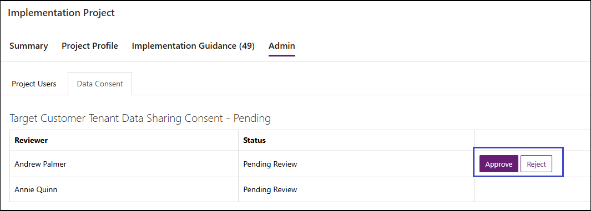

# Give or get consent to data sharing in your project

In this article, we introduce you to the process of approving data sharing in a Dynamics 365 implementation project. Based on Microsoft's [Privacy policy](https://privacy.microsoft.com/privacystatement), we require two contacts from the customer's organization to approve the implementation project's access to their organization's tenant. This allows partners to access information such as customer name and telemetry insights and ensures compliance with data protection regulations, building trust with customers.

After creating a project in the Implementation Portal, an **Admin** tab appears on the project page. This tab displays the consent status for the project from the reviewers.  

Similarly, when you set up [a telemetry request](telemetry-insights.md) in the **Set up telemetry** guide, you see all requests on the **Data Consent** page.  

## Process

When you create a new implementation project with [the onboarding wizard](onboard-project.md), or you [set up a telemetry request](telemetry-insights.md), there's an option to specify the tenant that you want to associate the project or telemetry request with, the current tenant or a different tenant. If you choose the option **Different Tenant**, then you must request consent to sharing data.

### Request consent

Both when you create a new project and when you set up telemetry, a new section, **Consent for data sharing**, appears if you choose the option **Different Tenant**.  

For both scenarios, Microsoft requires two contact email addresses from the customer organization as reviewers to trigger the consent process. The email addresses must belong to the specified tenant and have the format `name@company.com`.  

Provide the two email addresses, select the **Click here to confirm the emails provided are real organization users from the company that owns the target tenant, not out-sourced users** field, and then choose the **Submit** action.

An email is sent to both target tenant reviewers for them to approve your access along with the link and other details.  

### Email sent for approving consent

The sender of the email is `ftdyn365@microsoft.com`, and the subject is *Dynamics 365 Implementation Portal - Review access*. The body of the email specifies the name of the implementation project and the tenant ID, and it provides context for the request. The email has a link that opens the **Project Admin** tab in the Dynamics 365 Implementation Portal. Here, the reviewers can then review the request and take the next step.

## Approval status

On the approval page, the reviewers can choose to approve or reject the request.

The following table describes the status options of a data sharing request that other project users or admins see.

| **Data consent status** | **What it indicates** |
|-------------------------|-------------------------|
| **Not Applicable** | Data consent policy doesn't apply to this project because the project is created on the same tenant of user. |
| **Pending** | The request for consent is pending with either one or both reviewers. |
| **Not Allowed** | The request was rejected by the reviewers and canceled. You must submit a new request. |
| **Allowed** | The request has been approved by both reviewers. |

> [!NOTE]
> Both reviewers must approve the request for the data consent process to be complete. If the reviewers didn't receive the email, they can go to the **Admin > Data Consent** tab of the project in the Implementation Portal where they might see the approval options available. If there are still issues in approving the requests, please email [ftd365ip-support@microsoft.com](mailto:ftd365ip-support@microsoft.com).

## Admin tasks related to data consent requests

The following options are available only for project admins:

- [Cancel data consent requests](#cancel-data-consent-requests)  
- [Edit or change data consent reviewers](#edit-or-change-data-consent-reviewers)  
- [Approve and reject data sharing consent](#approve-and-reject-data-sharing-consent)  

### Cancel data consent requests

If a project admin wants to cancel the data consent, they can do so from the **Data Consent** tab. The following steps describe how to cancel a data consent for the implementation project itself, but similar steps apply for canceling data consent for telemetry insights where the **Data Consent** tab is in the **Telemetry insights** section of the Dynamics 365 Implementation Portal.  

1. Open the project in the Dynamics 365 Implementation Portal.

2. Choose the **Admin** section, and then choose the **Data Consent** tab.

3. Choose the **Cancel** option. This cancels the consent. It also makes the reviewer fields editable to modify the Reviewer contacts.

### Edit or change data consent reviewers

You can change the data consent reviewer emails in the **Data consent** view with the following steps.

1. On the **Data Consent** tab in the relevant area of the Implementation Portal, choose the **Edit** option on the reviewer names that you want to change, and then specify the new email address.  

2. Choose the checkbox to confirm that the user belongs to the target tenant, and then choose the **Update** action.

This sends an email to the newly added user for approval. The project admin can update the reviewer emails as required.

### Approve and reject data sharing consent

Reviewers receive an email to approve the request based on the following actions:

- The user provides the target tenant data to consent reviewers.
- The project admin updates the email IDs of the reviewers on the **Data Consent** tab.

The users receive a direct link to access the **Data consent** page, and they can approve or reject the request.

## Features unavailable if data consent is pending or rejected

As of March 2024:

- The customer name won't be resolved based on the provided tenant ID.

- Telemetry insights won't appear since that contains telemetry data from the customer environment.

## Feedback or questions?

Email your feedback or questions to [ftd365ip-support@microsoft.com](mailto:ftd365ip-support@microsoft.com).  

## Relation information

- [Create or join a project in the Implementation Portal](onboard-project.md)  
- [Telemetry insights overview (preview)](telemetry-insights.md)  
