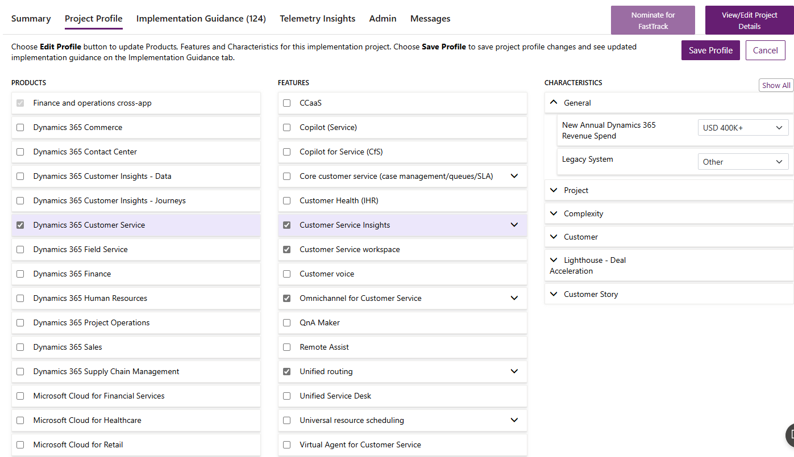
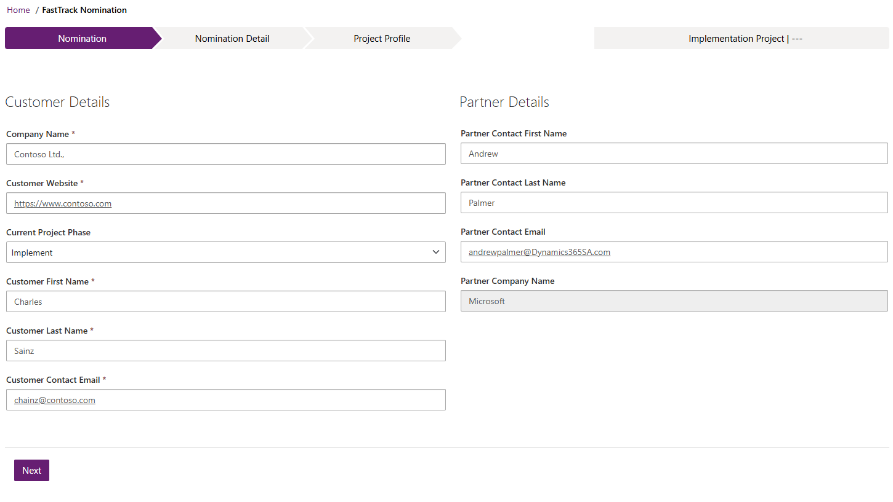
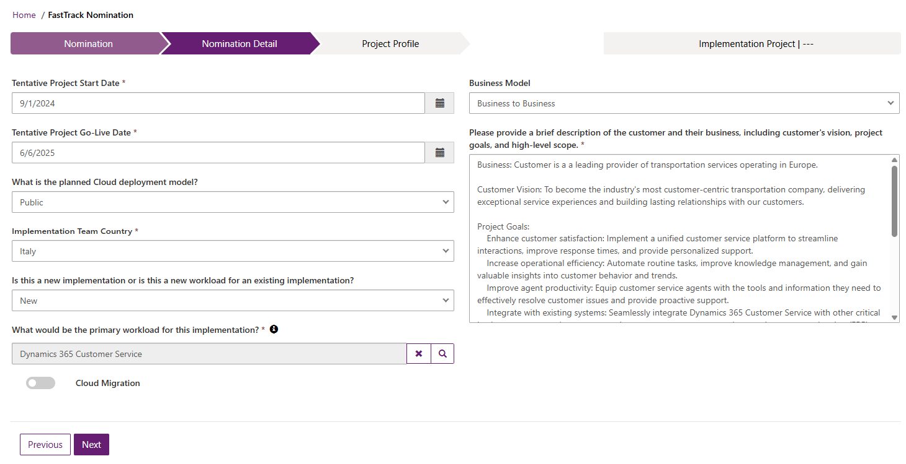
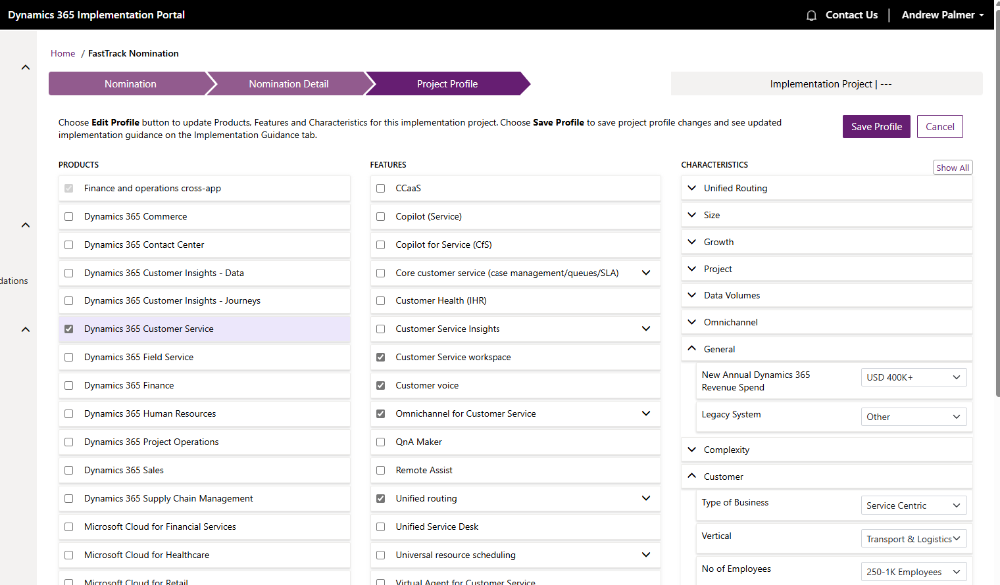
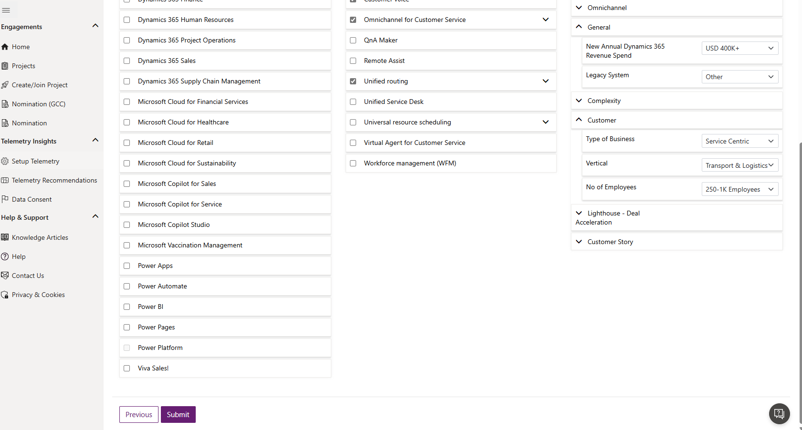
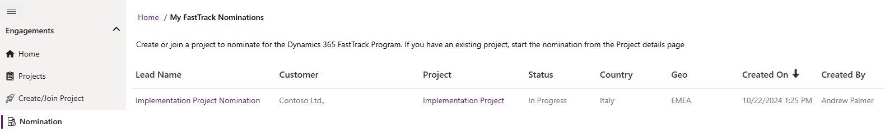

# Nominate projects for FastTrack

You can now nominate a project for FastTrack engagement in the Dynamics 365 Implementation Portal. This article describes the process to nominate a customer project for FastTrack.

> [!NOTE]
> The below steps are applicable only for public cloud projects. For Government Cloud projects, please submit the nomination using [this form](https://experience.dynamics.com/d365fasttracknomination/).

## Prerequisites

1. A project must already exist before you can nominate the customer. Microsoft uses the project profile to get the details about the project to automatically route to the right team.
2. If you do not have a project, create or join a project using the steps at [Create or join a project in the Implementation Portal](onboard-project.md).

## Update the project profile

1. Open the project, and then navigate to the **Profile** tab of the project.
2. Update the profile by adding as much information as possible in the **Products**, **Features**, and **Characteristics** sections, and then save the profile using the **Save** button.

  -  The **Products** and **Features** sections are linked. Depending on the product that you select, the related features appear.  
  -  The **Characteristics** section has the important fields for nomination such as *Annual Dynamics 365 Revenue Spend*, *Number of users*, *Complexity*, and so on. Make sure that you profile the project with as much information as possible.

  Learn more about what makes a good profile at [What is a good profile in the Dynamics 365 Implementation Portal?](project-profiling.md).
<!--  -->

The **Nominate for FastTrack** action becomes active once you have selected fields that fit the requirements.

## Nomination details

1. Once the **Nominate for FastTrack** button becomes active, choose it, and then enter the required details.
   
2. Fill all in the required fields on the **Nomination** and the **Nomination Detail** panes, and then choose the **Next** action to proceed.

   You must specify information about both the customer and your partner company, including the name and email address of the primary contact. You must also provide tenative dates for start and go-live phases for the the project, and information about the business model.
<!--   
    
   -->
4. Once done, review the project profile details, make any relevant changes, and save the changes.
<!--  -->

5. When you're ready, review the details again, and then choose the **Submit** action at the bottom of the page.
<!--  -->

### Track the nomination request

Once you submit the nomination, you can see the nomination request under the **Engagements > Nomination** section in the Implementation Portal. You'll receive an email with the next steps on the nomination.
<!--  -->

## Next step

[Manage projects in Dynamics 365 Implementation Portal](manage-projects.md)  

