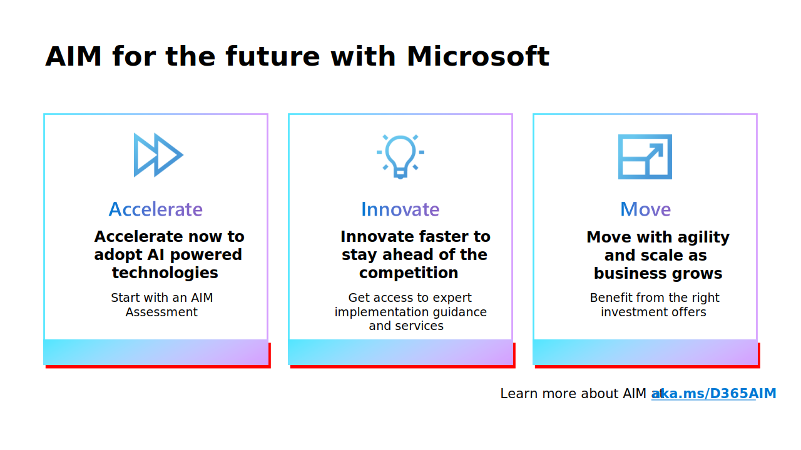

# Overview of the AIM migration program for on-premises solutions

AIM (Accelerate, Innovate, Move) is a new campaign and offering that provides qualified on-premises business applications customers a tailored path to the cloud with access to a dedicated team of migration advisors, expert business value and technology assessments, investment offers, tools, and migration support. Check out the video at [https://aka.ms/d365aim](https://aka.ms/d365aim), and find more information on the [website](https://aka.ms/d365aim). 

AI is taking center stage as a game-changing technology that promises to modernize the way work gets done. It's driving innovation across business applications, from streamlining operations to speeding time to actionable insight. 

Organizations that keep their business applications on-premises will miss the opportunity to unlock new business capabilities and outcomes. Copilots powered by AI are a catalyst for organizations with business applications on-premises to modernize their ERP and CRM systems in the cloud.

With the AIM campaign, we want to help these customers transform their critical business processes with confidence now, so they can benefit from AI-guided productivity.

> [!div class="mx-imgBorder"]
> 

AIM stands for *Accelerate, Innovate, Move*. With the campaign, we want to do three things for our customers:

1. Help customers to **accelerate** their transition to the cloud by starting with an assessment: an *AIM assessment* helps customers understand the business outcomes and technical dependencies of modernizing systems in the cloud and the steps to take. These assessments are delivered by Microsoft and the partner ecosystem.

2. Give customers the necessary support, services, and guidance during their implementation to **innovate** faster: customers have access to Success by Design implementation guidance (Dynamics 365 Customer Engagement (on-premises) and Dynamics 365 Finance + Operations (on-premises)), FastTrack services, and new Unified Support services. As part of AIM we will give partners access to more Success by Design tools and guidance and will increase our migration partner enablement efforts. In the SMB market (for solutions such as NAV, Business Central (on-premises), GP, and SL), we also want to support partners through a collaboration with AIM Modernization Centers. These service providers offer tools, assessments, and expert migration guidance to Microsoft partners and their customers.

3. We support customers to **move** with agility and scale to business growth with license and usage offers: the AIM campaign includes several offers that help customers optimize their investments. For example, we recently launched our Bridge to the Cloud 2 (BTTC2) promotional offer in CSP and expanded its coverage to more perpetual Dynamics on-premises products.

[!INCLUDE [migrate-aim-contact-partner](../includes/migrate-aim-contact-partner.md)]

For Microsoft **Partners**: Please visit [aka.ms/aimforpartners](https://aka.ms/aimforpartners) for more information and resources.  
