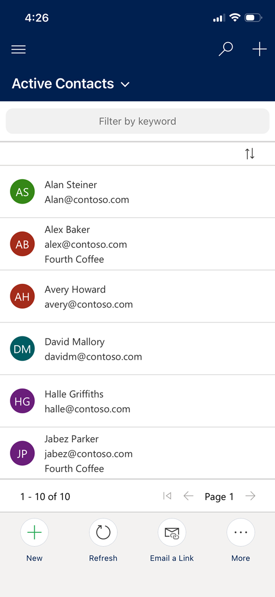

# Show more data and hide the row icon in the mobile app

Configure the Power Apps Grid control to hide the row icon, increase the number of columns, and show column labels in the mobile app grid. You can also configure the control on subgrids.

Support more fields so users can access comprehensive information at a glance, cutting down on time-consuming navigation. Streamline visuals by removing unnecessary icons to help workers stay focused on what matters most.

1. [Configure the Power Apps grid control](/power-apps/maker/model-driven-apps/the-power-apps-grid-control#configure-the-power-apps-grid-control) for the desired table.

1. In the grid **Properties**, make the control available for mobile devices.

1. Scroll down and edit the following settings:

   - **Show avatar**: Set to *No* to hide the colored circle showing the first letters of the row value from the list view.

   - **Show column names for list view**: Set to *Yes* to show column labels before values.

   - **Enable banded rows for list view**: Set to *Yes* to show shading on alternating rows.

   - **Number of columns for list view**: Adjust the value to the desired number of columns. The default number of columns for a list is three. The maximum number of columns is 10.

   :::image type="content" source="media/field-service-mobile-power-apps-grid-control.png" alt-text="Screenshot of the Power Apps grid control properties.":::

1. To enhance the mobile experience on iOS devices, consider setting the **Enable multi-select** property to *No*. This configuration ensures that tapping a record navigates to the record rather than selecting the record, reducing confusion and streamlining user interactions. If set to *Yes*, two taps are required to navigate to a record.

1. Save and publish.

    

You can also configure the Power Apps Grid control to subgrids within a form. Add the control as a component on the subgrid in the form and then configure it.
