# Field mapping for schedule board settings in Dynamics 365 Field Service

Universal Resource Scheduling for Dynamics 365 Field Service includes a schedule board with settings that let you define the layout and functions of schedule board tabs and the schedule board in general. Learn more at [Schedule board settings](/dynamics365/field-service/schedule-board-tab-settings#board-settings). Each schedule board that a user creates saves to a record in the **Schedule Board Settings** table (`msdyn_scheduleboardsetting`) in the underlying platform. Each field in the board settings maps to a particular column in the schedule board settings record for the relevant section.

Schedule board settings aren't solution-specific. When you understand how these settings are mapped in the schedule board settings table, you can develop mature [application lifecycle management (ALM) practices](/power-platform/alm/) for solutions with Dynamics 365 Field Service. For example, you can incorporate promotion and modification of schedule board tabs from one environment to the next in your ALM pipelines. Knowledge of these mappings also helps you troubleshoot and resolve issues in schedule boards.

> [!NOTE]
> Some board settings map to a specific column in the [ScheduleBoardSettings](/common-data-model/schema/core/applicationcommon/foundationcommon/crmcommon/projectcommon/scheduling/scheduleboardsetting) table while other board settings map to JSON attributes in the [`msdyn_settings`](/common-data-model/schema/core/applicationcommon/foundationcommon/crmcommon/projectcommon/scheduling/scheduleboardsetting#settings) column.

## Basic section

The following table shows where the underlying platform stores the values of the different fields in the **Basic** section. Learn more at [Basic section](/dynamics365/field-service/schedule-board-tab-settings#basic-section).

<!-- 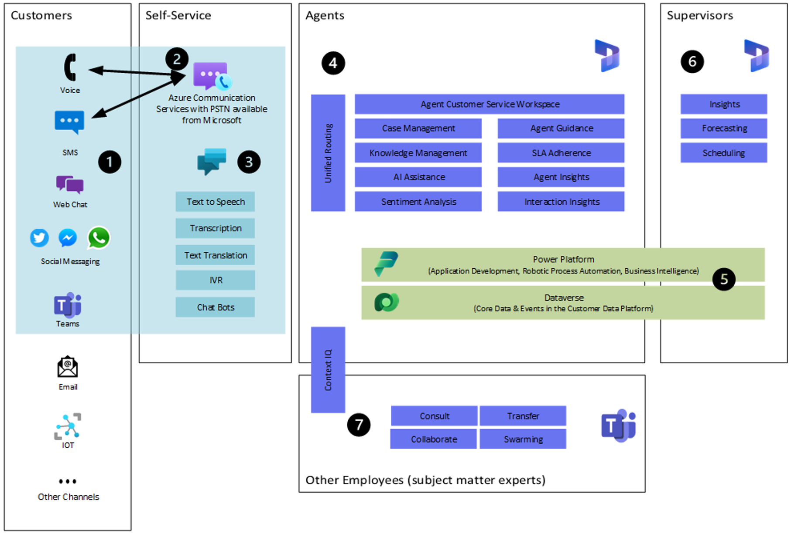 -->

|Field  |Column  |
|---------|---------|
|Board name |`msdyn_tabname`|
|Shared with | `msdyn_sharetype`|

## Map section

The following table shows where the underlying platform stores the values of the different fields in the **Map** section. Learn more at [Map section](/dynamics365/field-service/schedule-board-tab-settings#map-section).

<!-- 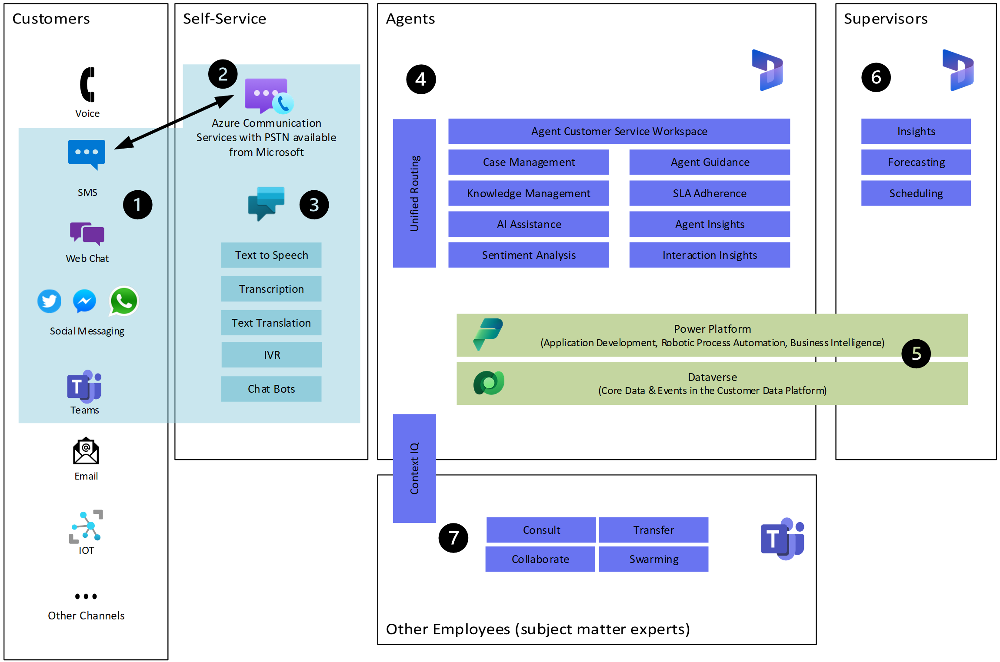 -->

|Field  |Column  |
|---------|---------|
|Resource tooltips view | `msdyn_schedulerresourcetooltipview`|
|Organizational unit tooltips view | `msdyn_organizationalunittooltipsviewid`|
|Requirement map filter view | `msdyn_unscheduledrequirementsviewid`|
|Resource details view | `msdyn_schedulerresourcedetailsview`|
|Organizational unit details view | `msdyn_organizationalunitviewid`|

## Custom web resource section

The following table shows where the underlying platform stores the values of the different fields in the **Custom web resource** section. Learn more at [Custom web resource](/dynamics365/field-service/schedule-board-tab-settings#custom-web-resource).

<!-- 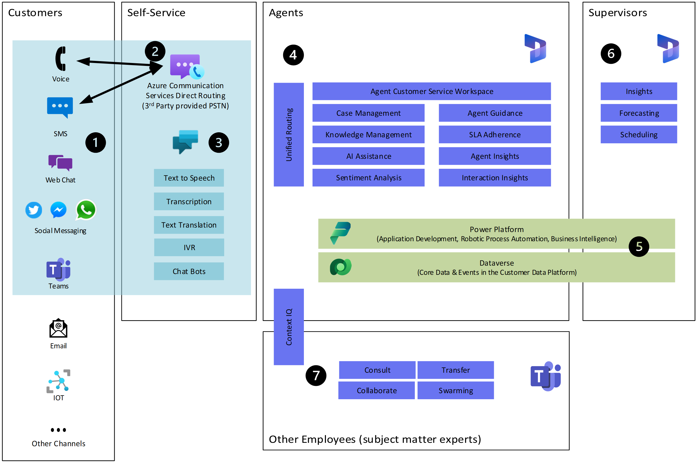 -->

|Field  |Column  |
|---------|---------|
|Title | `msdyn_customtabname`|
|Web resource | `msdyn_customtabwebresource`|

## Schedule assistant section

The following table shows where the underlying platform stores the values of the different fields in the **Schedule assistant** section. Learn more at [Schedule assistant](/dynamics365/field-service/schedule-board-tab-settings#schedule-assistant).

<!-- 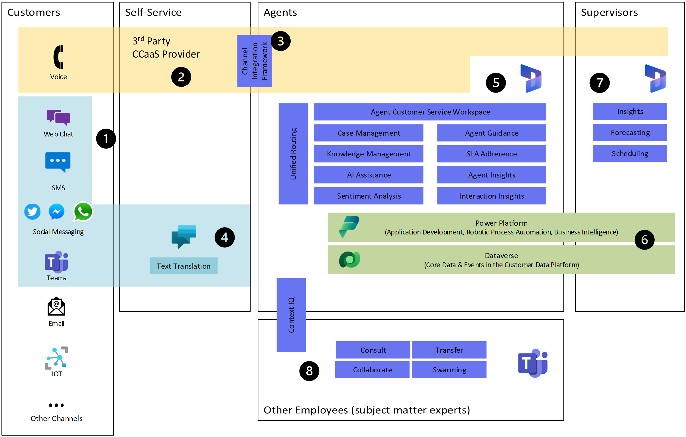 -->

|Field  |Column  |JSON attribute|
|---------|---------|-|
| Search for | `msdyn_settings` | `SASearchForDefault` |
| Unavailable resources | `msdyn_settings` | `SAHideUnavailableResources`|
|Available color | `msdyn_saavailablecolor`| |
|Unavailable color | `msdyn_saunavailablecolor`| |
|Partially available color | `msdyn_sapartiallyavailablecolor`| |
|Book based on | `msdyn_bookbasedon`| |
|Default available icon toggle | `msdyn_saavailableicondefault`| |
|Default available icon | `msdyn_saavailableicon`| |
|Default unavailable icon toggle | `msdyn_saunavailableicondefault`| |
|Default unavailable icon | `msdyn_saunavailableicon`| |
|Default partially available icon toggle | `msdyn_sapartiallyavailableicondefault`| |
|Default partially available icon | `msdyn_sapartiallyavailableicon`| |

## Board colors section

The following table shows where the underlying platform stores the values of the different fields in the **Board colors** section. Learn more at [Colors](/dynamics365/field-service/schedule-board-tab-settings#colors).

<!-- 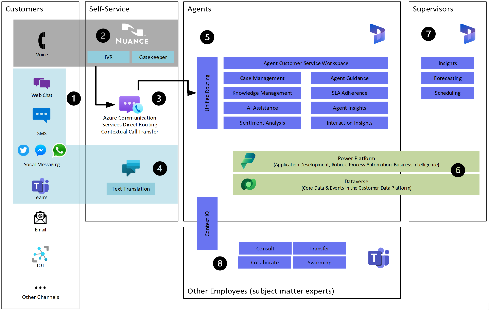 -->

|Field  |Column  |JSON attribute|
|---------|---------|-- |
|Fully booked | `msdyn_fullybookedcolor`| |
|Not booked | `msdyn_notbookedcolor`| |
|Non-working hours | `msdyn_workinghourscolor`||
|Overbooked | `msdyn_overbookedcolor`||
|Partially booked | `msdyn_partiallybookedcolor`||
|Current timeline | `msdyn_settings` | `CurrentTimelineColor`|

## Other section

The following table shows where the underlying platform stores the values of the different fields in the **Other** section. Learn more at [Other settings](/dynamics365/field-service/schedule-board-tab-settings#other-settings).

<!-- 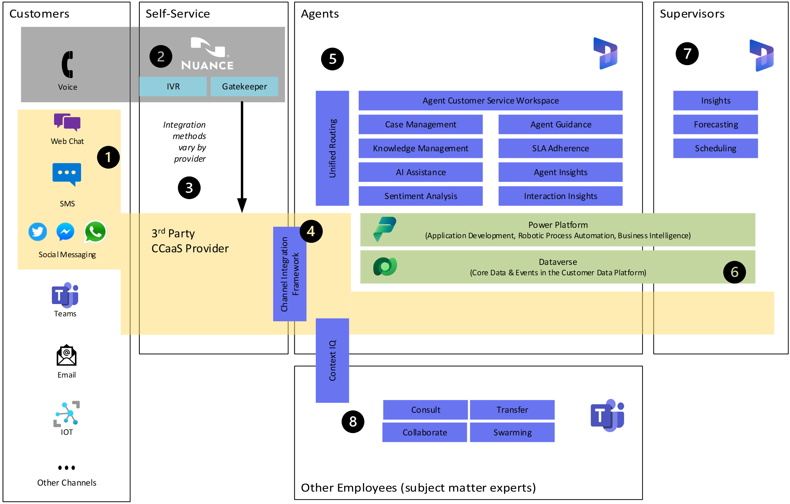 -->

|Field  |Column  |JSON attribute|
|---------|---------|--|
|Requirement page count | `msdyn_unscheduledwopagereccount`| |
| Number of days displayed in hours view | `msdyn_settings`| `viewModeSpecific:hourAndDay:modeUnitsCount`|
|Number of days displayed in days view | `msdyn_settings`| `viewModeSpecific:dayAndWeek:modeUnitsCount`|
|Booking alerts template | `msdyn_settings`| `BookingAlertTemplate`|
|Filter layout | `msdyn_filterlayout`|
|Booking alerts view | `msdyn_scheduleralertsview`| |
|Resource page count | `msdyn_settings`| `ResourcePageSize`|
|Number of weeks displayed in weeks view | `msdyn_settings`| `viewModeSpecific:weekAndMonth:modeUnitsCount`|
|Number of months displayed in months view | `msdyn_settings`| `viewModeSpecific:monthAndYear:modeUnitsCount`|
|Disable default extensions | `msdyn_settings`| `DisableDefaultExtensions`|
|[Resource cell template](field-service-resource-cell-template.md#step-2-modify-the-resource-cell-template) | `msdyn_resourcecelltemplate`| |
|[Retrieve resource query](field-service-resource-cell-template.md#step-1-modify-the-retrieve-resource-query) | `msdyn_retrieveresourcesquery`| |

> [!NOTE]
> Filter layout, Resource cell template, and Retrieve resource query settings are all mapped to lookup columns in the `msdyn_scheduleboardsetting` record pointing to the `msdyn_configuration` table. You must have the requisite `msdyn_configuration` table records present in your higher environment with the appropriate matching source GUIDs before migrating the schedule board settings record outright.

## Schedule types section

The following table shows where the underlying platform stores the values of the different fields in the **Schedule types** tabs. Learn more at [Schedule types](/dynamics365/field-service/schedule-board-tab-settings#schedule-types).  

The fields on this page all map to the `SlotMetadataCollection` attribute in the `msdyn_settings` column's JSON. The `SlotMetadataCollection` is an array of three `SlotMetadata` attributes, one for each  schedule type in the menu, **None**, **Appointment**, and **Work Order**. The `BookingSetupMetadataId` value determines which `SlotMetadata` attribute applies to the corresponding type:  

1. **None**: `49bc77c5-3a9e-4a0b-a903-0a3a4d352f5d`  
2. **Appointment**: `187989a1-41f1-e711-8130-000d3af982f3`  
3. **Work Order**: `d59df12a-aedb-4f82-b5b8-9a6eba4f1712`  

<!-- 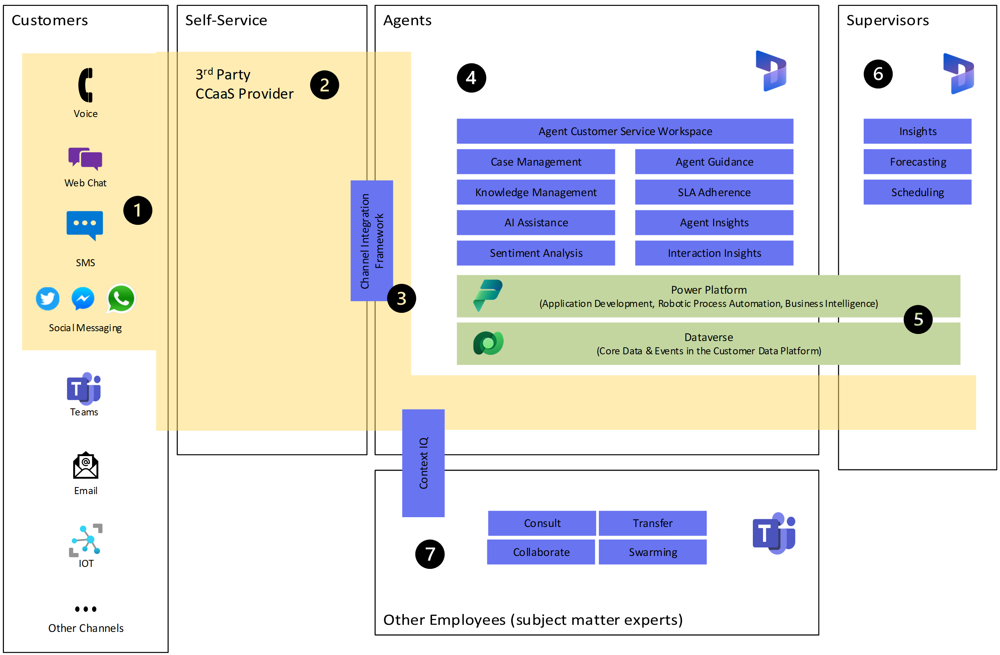 -->

|Field  |Column  | JSON attribute |
|---------|---------|--|
|Booking tooltips view | `msdyn_settings`| `SlotMetadataCollection`:`TooltipViewId`|
|Booking details view | `msdyn_settings`| `SlotMetadataCollection`:`DetailsViewId`|
|Schedule assistant requirement view | `msdyn_settings`| `SlotMetadataCollection`:`RequirementDetailsPanelViewId`|
|Requirement details view | `msdyn_settings`| `SlotMetadataCollection`:`RequirementDetailsViewId`|
|Requirement map pin tooltips view | `msdyn_settings`| `SlotMetadataCollection`:`UnschReqMapPinTooltipViewId`|
|Custom booking template | `msdyn_settings`| `SlotMetadataCollection`:`SlotTemplate`|

## Requirement panels section

The following table shows where the underlying platform stores the values of the different fields in the **Requirement panels** section. Learn more at [Requirement panels](/dynamics365/field-service/schedule-board-tab-settings#requirement-panels).

<!-- 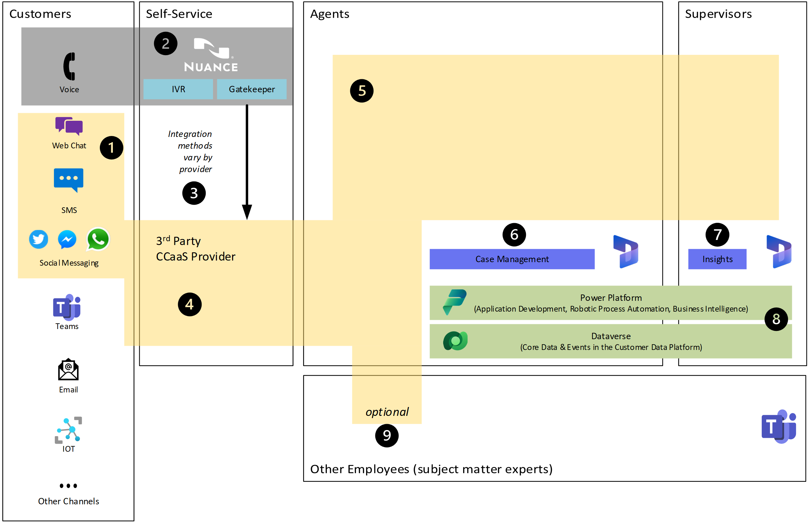 -->

For all fields on the **Requirement panels** tab, `UnscheduledTabs` is a collection of `UnscheduledTab` objects in the `msdyn_settings`column's JSON. Each `UnscheduledTab` object contains attributes that store the **Title**, **View type**, and **View settings** that a user sets for each tab. When the user chooses the + (plus) action, a new `UnscheduledTab` object gets added to the `UnscheduledTabs` collection with the attributes as defined. Conversely, the - (minus) action removes the relevant `UnscheduledTab` object from the `UnscheduledTabs` collection.

|Field  |Column  | JSON attribute |
|---------|---------|--|
|Title | `msdyn_settings`| `UnscheduledTabs`:`Title`|
|View type | `msdyn_settings`| `UnscheduledTabs`:`ViewType`|
|View | `msdyn_settings`| `UnscheduledTabs`:`UnscheduledView`|
|Show default requirement panels | `msdyn_settings`| `HideDefaultUnscheduledPanels`|
|Apply territory filter to requirements | `msdyn_settings`| ``applyFilterTerritory``|

## Board view settings side pane

<!-- 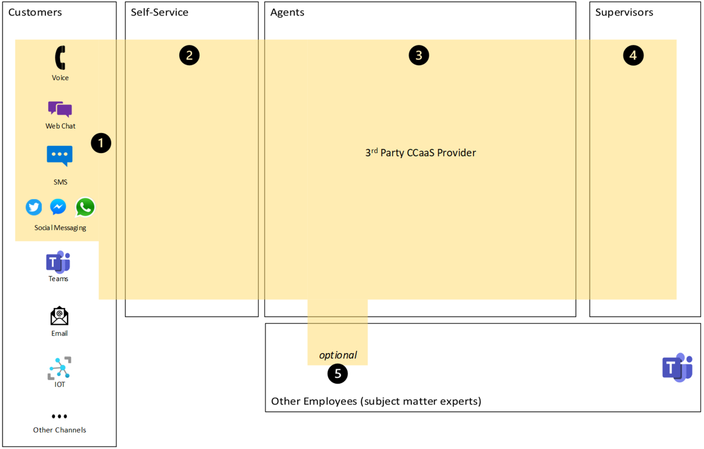 -->

The following table shows where the underlying platform stores the values of the different fields in the **Board view settings** panel. Learn more at  [Board view settings](/dynamics365/field-service/schedule-board-tab-settings#board-view-settings).

<!-- 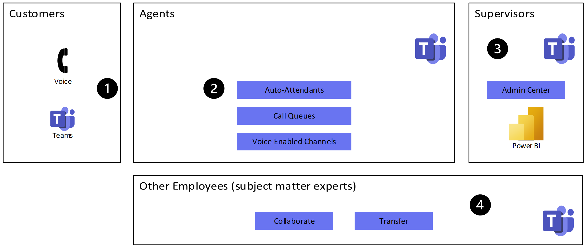 -->

|Field  |Column  |JSON attribute|Comment|
|---------|---------|--|--|
|Time zone |`msdyn_settings` | `TimeOffsetSetting`|The `TimeOffsetSetting` JSON attribute in the `msdyn_settings` column references the [`timezonedefinition`](/power-apps/developer/data-platform/reference/entities/timezonedefinition) table. The `timezonedefinition` table has the same IDs per time zone in each environment by design.|
|Working time (start) | `msdyn_settings`| `WorkHours`:`start`|  |
|Working time (end) | `msdyn_settings`| `WorkHours`:`end` | Working time values are stored in the `start` and `end` JSON attributes as 24-hour integer values. For example, it's *9*, not *9 AM*, and *17* rather than *5 PM*. You can only see the working time selectors when you view the hourly time scale. The values only apply to that time scale.|
|Working days | `msdyn_settings`| `WorkDays`| In the `msdyn_settings` JSON, working days show as a collection of named days with Boolean attribute values. Working days are days that are set to `true`. You can only see the working days selectors when you view the hourly time scale. The values only apply to that time scale.|
|Time resolution | `msdyn_settings`| `TimeResolution`|  |
|Row height | `msdyn_settings`| `viewModeSpecific:x:RowHeight`| Row height for the **Board view settings** pane is stored in the appropriate `viewModeSpecific` `RowHeight` attribute depending on the current [time scale](/dynamics365/field-service/work-with-schedule-board#time-scale) being viewed. The `x` in the attribute column for this row represents *hourAndDay* for hourly, *dayAndWeek* for daily, *weekAndMonth* for weekly, and *monthAndYear* for monthly.|
|Show canceled | `msdyn_settings`| `hideCancelled`| The `hideCancelled` JSON attribute only shows in the `msdyn_settings` JSON if the **Show canceled** field isn't selected, and it has an integer value of 1. If the **Show canceled** field is selected, there's no `hideCancelled` JSON attribute enumerated in `msdyn_settings`.|
| Apply territory filter to requirements | `msdyn_settings`| `applyFilterTerritory`| The `applyFilterTerritory` JSON attribute only shows in the `msdyn_settings` JSON if the **Apply territory filter to requirements** setting is set to *On*, with an integer value of 1. If the **Apply territory filter to requirements** field isn't selected, there's no `applyFilterTerritory` JSON attribute enumerated in `msdyn_settings`.|
|Show travel duration | `msdyn_settings`| `showTravelTime`| The `showTravelTime` JSON attribute only shows in the `msdyn_settings` JSON if the **Show travel duration** field is set to *On*, with an integer value of 1. If the **Show travel duration** isn't selected, there's no `showTravelTime` JSON attribute enumerated in `msdyn_settings`.|
|Show bookings proportional to duration | `msdyn_settings`| `showBookingsProportionally`| The `showBookingsProportionally` JSON attribute only shows in the `msdyn_settings` JSON if the **Show bookings proportional to duration** field is set to On, with a Boolean value of `true`. If the **Show bookings proportional to duration** field isn't selected, there's no `showBookingsProportionally` JSON attribute enumerated in `msdyn_settings`. Additionally, the **Show bookings proportional to duration** setting only shows in the **Board view settings** side pane for the **Daily**, **Weekly**, and **Monthly** time scales.|

## Time scale selector

<!-- 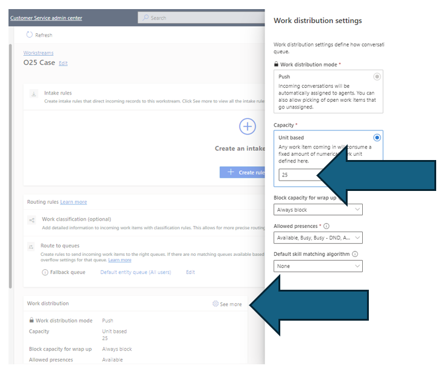 -->

The [Time scale](/dynamics365/field-service/work-with-schedule-board#time-scale) selector setting gets saved in the `msdyn_settings` JSON as an attribute named ViewMode. The attribute values are *hourAndDay* for hourly, *dayAndWeek* for daily, *weekAndMonth* for weekly, and *monthAndYear* for monthly.

## Resource filters side pane

The following table shows where the underlying platform stores the values of the different fields in the **Resource filters** side pane. Learn more at [Filters](/dynamics365/field-service/work-with-schedule-board#filters).

<!-- 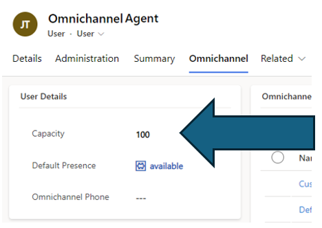 -->

The **Save as default** button collects all the current values in the **Resource filters** fields and saves them to a JSON payload in the `msdyn_filtervalues` column on the `msdyn_scheduleboardsettings` record. The **Characteristics** – **Rating**, **Roles**, **Territories**, **Organizational Units**, **Teams**, and **Business Units** fields on the filter pane save as individual collections of lookup field references per field. The **Resource Types** and **Pool Types** multi-select fields save as individual collections of option set references. Each individual collection is defined in the JSON with the appropriate name as is shown in the user interface.

## Schedule board settings column reference

The following sample illustrates the data types for each column in the `msdyn_scheduleboardsetting` table/entity. Find the reference documentation at [Schedule Board Setting in scheduling](/common-data-model/schema/core/applicationcommon/foundationcommon/crmcommon/projectcommon/scheduling/scheduleboardsetting).

> [!NOTE]
> The `msdyn_settings` column is of data type `string`, regardless of the data types of the JSON attributes that are stored in the column. All retrieves and updates to this column are passed as string data type with appropriate escape characters enumerated as a result.

```xml
  <entities>
    <entity name="msdyn_scheduleboardsetting" displayname="Schedule Board Setting" etc="11017" primaryidfield="msdyn_scheduleboardsettingid" primarynamefield="msdyn_tabname" disableplugins="false">
    <fields>
      <field displayname="Book Based On" name="msdyn_bookbasedon" type="bool" customfield="true" />
      <field displayname="Business Unit Tooltips View (Deprecated)" name="msdyn_schedulerbusinessunittooltipview" type="string" customfield="true" />
      <field displayname="Core Details View (Deprecated)" name="msdyn_schedulercoredetailsview" type="string" customfield="true" />
      <field displayname="Core Slot Text Template (Deprecated)" name="msdyn_schedulercoreslottexttemplate" type="string" customfield="true" />
      <field displayname="Core Tooltip View (Deprecated)" name="msdyn_schedulercoretooltipview" type="string" customfield="true" />
      <field displayname="Created By" name="createdby" type="entityreference" lookupType="systemuser" />
      <field displayname="Created By (Delegate)" name="createdonbehalfby" type="entityreference" lookupType="systemuser" />
      <field displayname="Created On" name="createdon" type="datetime" />
      <field displayname="Custom Tab Name" name="msdyn_customtabname" type="string" customfield="true" />
      <field displayname="Custom Tab Web Resource" name="msdyn_customtabwebresource" type="string" customfield="true" />
      <field displayname="Field Service Details View (Deprecated)" name="msdyn_schedulerfieldservicedetailsview" type="string" customfield="true" />
      <field displayname="Field Service Slot Text Template (Deprecated)" name="msdyn_schedulerfieldserviceslottexttemplate" type="string" customfield="true" />
      <field displayname="Field Service Tooltip View (Deprecated)" name="msdyn_schedulerfieldservicetooltipview" type="string" customfield="true" />
      <field displayname="Filter Layout" name="msdyn_filterlayout" type="entityreference" lookupType="msdyn_configuration" customfield="true" />
      <field displayname="Filter Values" name="msdyn_filtervalues" type="string" customfield="true" />
      <field displayname="Fully Booked Color" name="msdyn_fullybookedcolor" type="string" customfield="true" />
      <field displayname="Hide Canceled" name="msdyn_hidecancelled" type="bool" customfield="true" />
      <field displayname="Import Sequence Number" name="importsequencenumber" type="number" />
      <field displayname="Is Public (Deprecated)" name="msdyn_ispublic" type="bool" customfield="true" />
      <field displayname="Is Synchronize Resources" name="msdyn_issynchronizeresources" type="bool" customfield="true" />
      <field displayname="Map View Tab Placement" name="msdyn_mapviewtabplacement" type="bool" customfield="true" />
      <field displayname="Modified By" name="modifiedby" type="entityreference" lookupType="systemuser" />
      <field displayname="Modified By (Delegate)" name="modifiedonbehalfby" type="entityreference" lookupType="systemuser" />
      <field displayname="Modified On" name="modifiedon" type="datetime" />
      <field displayname="Non-Working Hours Color" name="msdyn_workinghourscolor" type="string" customfield="true" />
      <field displayname="Not Booked Color" name="msdyn_notbookedcolor" type="string" customfield="true" />
      <field displayname="Order Number" name="msdyn_ordernumber" type="number" customfield="true" />
      <field displayname="Organizational Unit Tooltips View Id" name="msdyn_organizationalunittooltipsviewid" type="string" customfield="true" />
      <field displayname="Organizational Unit View Id" name="msdyn_organizationalunitviewid" type="string" customfield="true" />
      <field displayname="Overbooked Color" name="msdyn_overbookedcolor" type="string" customfield="true" />
      <field displayname="Owner" name="ownerid" type="owner" />
      <field displayname="Owning Business Unit" name="owningbusinessunit" type="entityreference" lookupType="businessunit" />
      <field displayname="Owning Team" name="owningteam" type="entityreference" lookupType="team" />
      <field displayname="Owning User" name="owninguser" type="entityreference" lookupType="systemuser" />
      <field displayname="Partially Booked Color" name="msdyn_partiallybookedcolor" type="string" customfield="true" />
      <field displayname="Record Created On" name="overriddencreatedon" type="datetime" />
      <field displayname="Requirements View Id" name="msdyn_unscheduledrequirementsviewid" type="string" customfield="true" />
      <field displayname="Resource Cell Template" name="msdyn_resourcecelltemplate" type="entityreference" lookupType="msdyn_configuration" customfield="true" />
      <field displayname="Resource Details View" name="msdyn_schedulerresourcedetailsview" type="string" customfield="true" />
      <field displayname="Resource Requirement View Page Record Count" name="msdyn_unscheduledwopagereccount" type="number" customfield="true" />
      <field displayname="Resource Tooltips View" name="msdyn_schedulerresourcetooltipview" type="string" customfield="true" />
      <field displayname="Retrieve Resources Query" name="msdyn_retrieveresourcesquery" type="entityreference" lookupType="msdyn_configuration" customfield="true" />
      <field displayname="SA Available Color" name="msdyn_saavailablecolor" type="string" customfield="true" />
      <field displayname="SA Available Icon" name="msdyn_saavailableicon" type="string" customfield="true" />
      <field displayname="SA Available Icon Default" name="msdyn_saavailableicondefault" type="bool" customfield="true" />
      <field displayname="SA Partially Available Color" name="msdyn_sapartiallyavailablecolor" type="string" customfield="true" />
      <field displayname="SA Partially Available Icon" name="msdyn_sapartiallyavailableicon" type="string" customfield="true" />
      <field displayname="SA Partially Available Icon Default" name="msdyn_sapartiallyavailableicondefault" type="bool" customfield="true" />
      <field displayname="SA Unavailable Color" name="msdyn_saunavailablecolor" type="string" customfield="true" />
      <field displayname="SA Unavailable Icon" name="msdyn_saunavailableicon" type="string" customfield="true" />
      <field displayname="SA Unavailable Icon Default" name="msdyn_saunavailableicondefault" type="bool" customfield="true" />
      <field displayname="Schedule Board Setting" name="msdyn_scheduleboardsettingid" type="guid" primaryKey="true" />
      <field displayname="Scheduler Alerts View" name="msdyn_scheduleralertsview" type="string" customfield="true" />
      <field displayname="Settings" name="msdyn_settings" type="string" customfield="true" />
      <field displayname="Share Type" name="msdyn_sharetype" type="optionsetvalue" customfield="true" />
      <field displayname="Status" name="statecode" type="state" />
      <field displayname="Status Reason" name="statuscode" type="status" />
      <field displayname="Tab name" name="msdyn_tabname" type="string" customfield="true" />
      <field displayname="Time Zone Rule Version Number" name="timezoneruleversionnumber" type="number" />
      <field displayname="Unit Details View (Deprecated)" name="msdyn_schedulerbusinessunitdetailsview" type="string" customfield="true" />
      <field displayname="Unscheduled View (Deprecated)" name="msdyn_unscheduledviewid" type="string" customfield="true" />
      <field displayname="Unscheduled WO Tooltips View (Deprecated)" name="msdyn_unscheduledwotooltipsviewid" type="string" customfield="true" />
      <field displayname="UTC Conversion Time Zone Code" name="utcconversiontimezonecode" type="number" />
      <field displayname="Version Number" name="versionnumber" type="bigint" />
    </fields>
    <relationships />
  </entity>
```

## Related information

- [Universal Resource Scheduling for Dynamics 365 Field Service overview](/dynamics365/field-service/universal-resource-scheduling-for-field-service)  
- [Schedule board settings](/dynamics365/field-service/schedule-board-tab-settings)  
- [Customize the schedule board with a custom resource attribute](/dynamics365/field-service/extend-schedule-board-custom-resource-attribute)  
- [Schedule Board Setting in scheduling (Common Data Model entity model reference)](/common-data-model/schema/core/applicationcommon/foundationcommon/crmcommon/projectcommon/scheduling/scheduleboardsetting)  
