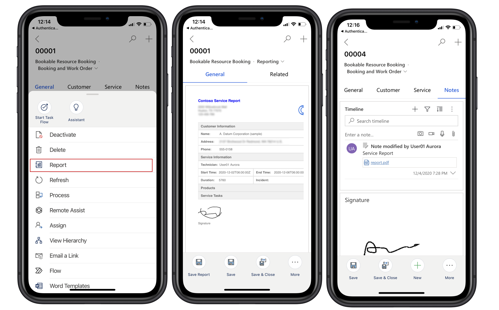

---
title: Add custom service reports in Dynamics 365 Field Service
description: Customize and deploy a reporting solution in Dynamics 365 Field Service to streamline service report generation for technicians.
#customer intent: As a Dynamics 365 admin, I want to integrate the reporting solution into the production environment so that it is available for technicians.
author: JonBaker007
contributors: JonBaker007
ms.topic: concept-article
ms.date: 05/12/2025
ms.author: edupont
ms.reviewer: edupont
ms.custom:
  - ai-gen-docs-bap
  - ai-gen-title
  - ai-seo-date:04/28/2025
  - ai-gen-description
---  

# Add custom service reports in Dynamics 365 Field Service

***Applies to: Dynamics 365 Field Service***

Service reports play a critical role in summarizing the work completed by technicians, including tasks performed, parts used, and the customer's signature. You can streamline the experience in Dynamics 365 Field Service by implementing a customizable reporting solution. This article provides step-by-step guidance on how to install, customize, and deploy a customizable sample reporting solution using the Power Apps component framework (PCF). By following these instructions, administrators can enable technicians to generate professional service reports directly from the Field Service mobile or web app, even in offline scenarios.

This article shows you how you can implement a sample reporting solution with a custom control and apply relevant customizations so that service technicians can generate service reports that summarize their work in Dynamics 365 Field Service.  

Service reports can contain details such as tasks completed, and products or parts used during the service. Technicians can capture their customer's signature on the report and then save it to the timeline of the relevant bookings. Technicians can also deliver the generated service reports to the customer as a PDF file. Technicians also have access to the report even without internet connectivity.

Service reports are available in the mobile app and web app. For a guided walkthrough, check out the following video.

>
> [!VIDEO 9743a9c9-3c5c-433d-8609-52acb0420302]

## Install the reporting solution

> [!NOTE]
> If you installed an earlier version of the reporting solution, uninstall it before installing this new solution to avoid conflicts.

### Import and try the sample reporting solution as-is in a sandbox environment

1. Download [ReportingSolution_managed.zip](https://github.com/microsoft/Dynamics-365-FastTrack-Implementation-Assets/blob/master/Field%20Service/Component%20Library/FSMobile/Service%20Report/solutions/ReportingSolution_managed.zip).
1. [Import the reporting solution](/power-apps/maker/data-platform/import-update-export-solutions) into your environment. The import installs a reporting form, a command for the command bar, and includes a sample report. We recommend importing the solution as a managed solution.
1. Find the **Field Service Mobile** app module in your list of Dynamics 365 apps and select the ellipsis (&hellip;) > **Open in App Designer**.
1. In the navigation, select the **Bookings form**.
1. On the right side pane, select the ellipsis (&hellip;) for the **Reporting** form and select **Add**.

    This step enables the **Reporting** form for the **Bookable Resource Booking** entity.
1. Select **Save & Publish**.
1. Test the [sample reports](#generate-service-reports).

If you like the sample solution, you can further customize the report to meet your specific business needs using the source code and templates that the package includes.  

### Customize the reporting solution before installation in a sandbox environment

1. Download the source code for the sample service report (PCF) from [Dynamics-365-FastTrack-Implementation-Assets](https://github.com/microsoft/Dynamics-365-FastTrack-Implementation-Assets/tree/master/Field%20Service/Component%20Library/FSMobile/Service%20Report)
1. Use your favorite IDE to edit the PCF control. Modify this control to change the layout, add branding, updated data, or other updates necessary to meet your reporting requirements.  

    Read the [Extend the control](#extend-the-control) section for more details.
1. After completing the modifications, run the `msbuild /t:build /restore` command from the control's root folder.  

    This step helps make sure that all necessary packages are downloaded and build the projects to generate both unmanaged and managed solutions for import under the *\solutions\FieldServiceReporting\Solution\bin\Debug* directory.
1. Import the reporting solution into your development environment.
1. Open your app module in App Designer, and then enable the **Reporting** form for the **Bookable Resource Booking** entity.
1. Test and follow your organization's application lifecycle management practices to import the solution to a non-development environment.

## Extend the control

This solution uses the Power Apps component framework (PCF) control. Install the following components:

- [Visual Studio Code](https://code.visualstudio.com/Download)  

  Choose the **Add to PATH** option.
- [node.js](https://nodejs.org/en/download/)  
- [Microsoft Power Platform CLI](/powerapps/developer/data-platform/powerapps-cli#install-power-apps-cli)  

  > [!TIP]
  > Use the Visual Studio Code extension.

Learn more about how to create and deploy code components using Microsoft Power Platform CLI at [Create and build a code component - Power Apps](/power-apps/developer/component-framework/create-custom-controls-using-pcf).

### Basic code customizations

The first step is to change the name of the PCF control by changing the name from *ReportPreview* to anything else in these files:

- `ControlManifest.Input.xml`
- `index.ts`
- `css/viewer.css`

To change the report visuals, you probably just have to modify these two files:

- `ReportPreview/SampleReport.tsx`
- `ReportPreview/styles.ts`

`SampleReport.tsx` contains the code that renders the report view. It's what shows on the reporting form and gets converted to a PDF when the use saves the report.

You can add CSS to the report PDF by modifying `styles.ts`. If you want to change how the report is rendered in the app/browser without affecting the final PDF that is generated, you can make CSS changes to `ReportPreview/viewer.css`.

To view your changes locally, run `npm install` and `npm start` in the PCF control's root folder.

To build the control and deploy it into an org, increment the version number in `ControlManifest.Input.xml`, build, and import the control.  

### Add data from other entities to the report

You can also fetch any other data you want and add it to the report. Whatever entities you want to use must also be enabled for offline.

The general steps for adding custom data to the report:

1. Define your new data type (`ReportPreview/models/ReportViewerModel.ts`)
1. Add custom query to fetch data (`ReportPreview/DataProviders/GetReportData.ts`)
1. Pass the data to the report (`index.ts`)
1. Display and style the data on the report (`ReportPreview/SampleReport/SampleReport.tsx`)

For example, to add data from the Account entity, start by defining your data type in `ReportPreview/models/ReportViewerModel.ts`:  

```TypeScript
export class Account {
    name: string;
    email: string;
    phone: string;
    // add any other fields you would like to include
}
```

Extend the report properties by adding an entry to `ReportViewerProps`:

```TypeScript
export interface ReportViewerProps {
    account: Account;  <--- (add your new data type here) 
    booking: Booking;
    serviceInfo: ServiceInfo;
    ...
}
```

Now, you can add a query in the `GetReportData.ts` file to fetch this data. There are many examples already there to refer to. There's also tons of documentation on Microsoft Learn on fetching data using [the web API](/powerapps/developer/model-driven-apps/clientapi/reference/xrm-webapi)

Skip this step to preview how the report looks.  

Now, pass the data to the report by calling your query in index.ts:

```TypeScript
public getDataFetchPromises(): Promise<any>[] {
        let dataGetter = new GetReportData(this._context);

        const updateAccountData = dataGetter.getAccountData().then(
            (account) => {
                this.props.account = account;                               <--- Trigger the data fetch
                this.renderReportViewer(this.props);
            }
        );

        const updateBookingData = dataGetter.getBookingData().then(
            (booking) => {
                this.props.booking = booking;
                this.renderReportViewer(this.props);
            }
        );
        return [updateAccountData, updateBookingData ... ]
}
```

Add a default value for the account to the props:  

```TypeScript
this.props = {
    account: undefined,
    booking: undefined,
    products: [],
    ...
}
```

Now the data should be available in SampleReport.tsx for you to display. You can display it in any way you see fit, but can also use some of the helper functions available:

```TypeScript
<FieldInfo name="Account name" value={account?.name}></FieldInfo>
```

Run `npm start` to see how the report looks or build and import it into your org. There are comments throughout the files with instructions so that you can do even more, such as download and use more font types, add images, and so on.

> [!NOTE]
> The report is available offline if the data it uses is included in your offline profile. If the report is pulling data from the typical work order, the offline profile is already set up. If you're pulling other entities, make sure that they're included in your offline profile so they can be downloaded to the device and available for the report.

### Add custom font

In some cases, you need a custom font for the PDF file, or to handle special characters for certain languages. We can do that by adding a custom font for jsPDF.

Edit the `ReportPreview\helpers\pdfPrinter.js` file.

```TypeScript
        //Use an online tool to create a base64 content of a custom font file
        const customFont = 'BASE64 CONTENT';  

        // Adding a custom font
        pdf.addFileToVFS("customFont.ttf", customFont);
        pdf.addFont("customFont.ttf", "customFontName", "normal");
        pdf.setFont("customFontName", "normal");

        // Note: 'customFontName' should match the font used on the generated HTML report (see reportPreview/styles.ts)
```

### Navigate to timeline

After a report is saved, the app generates a notification that will navigate users to the timeline tab. The app navigates the user to the tab named `fstab_Timeline`. You can change this navigation by modifying `common/Constants.ts` in the PCF control or renaming the tab in the organization's customizations.  

## Enable technicians to generate service reports

When you're ready, integrate the customized reporting solution into your production environment for use in Dynamics 365 Field Service as a custom Power Apps component framework control. Follow the same steps as for [importing the solution to your sandbox environment](#import-and-try-the-sample-reporting-solution-as-is-in-a-sandbox-environment).

## Generate service reports

Technicians can create service reports in both the mobile app and the web app.

### In the Field Service mobile app

1. Open a booking in the Field Service mobile app.

1. Go to **More** > **Report**.

1. Capture a signature if necessary and select **Confirm**.

1. To save the report, select **More** > **Save to Timeline**.

    

### In the web app

Administrators and dispatchers can also generate reports when viewing a booking in the Field Service web application.

1. Open a booking in the Field Service web app.

1. In the command bar, select **Report**.

1. To save the report, select **Save to Timeline** in the command bar.

> [!NOTE]  
> At this point, the reporting solution, including the sample report and the code is provided as-is, and it's considered a *custom control* by Microsoft. Microsoft doesn't provide support for it.

<!-- ## Tags

*Field Service Features:* Service Reports, Field Service Mobile, PCF control  

*Products:* Dynamics 365 Field Service, Dynamics 365 Field Service Mobile, O25-FieldService   -->
## Related information

- [Enable technicians to create service reports](/dynamics365/field-service/mobile/create-service-report-admin)  
- [Create service reports](/dynamics365/field-service/mobile/create-service-report)
