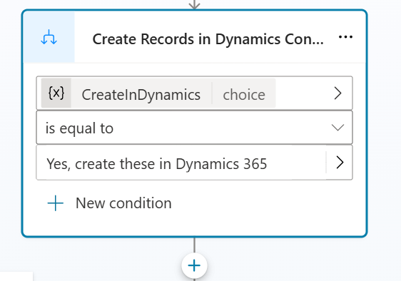
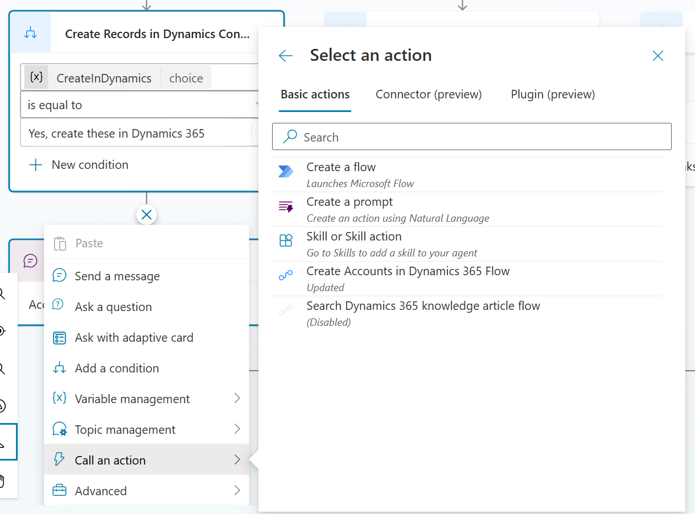
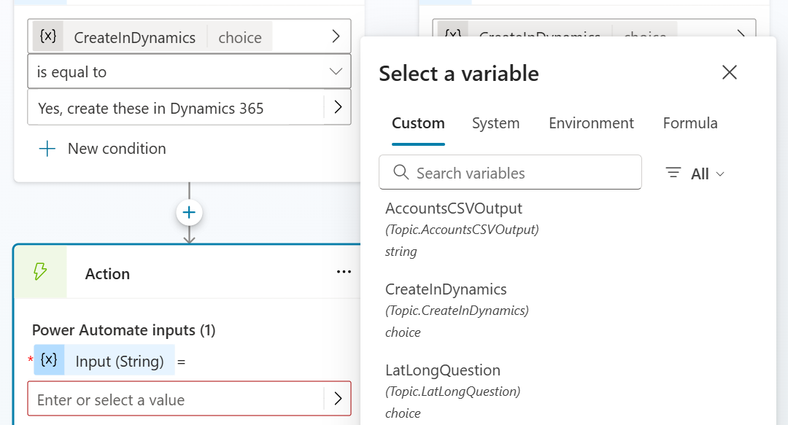
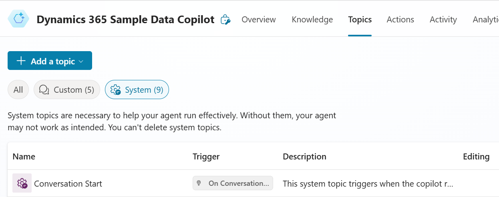
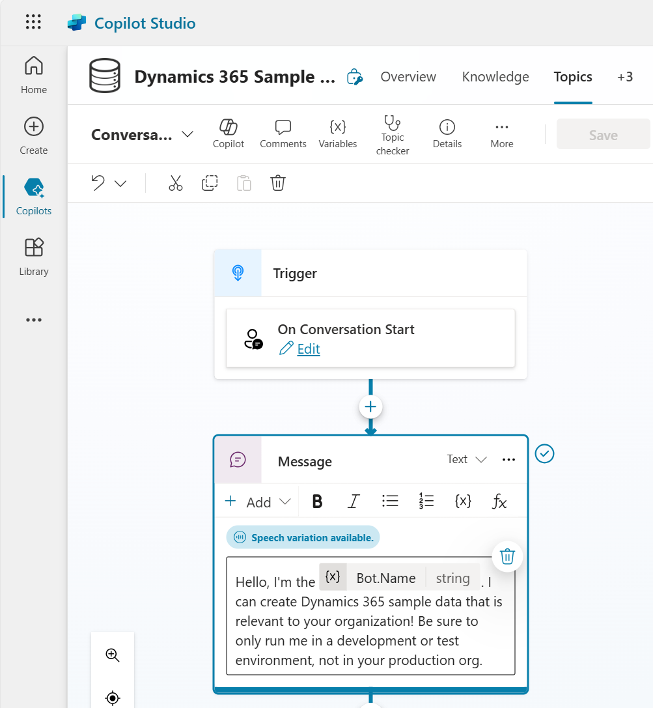
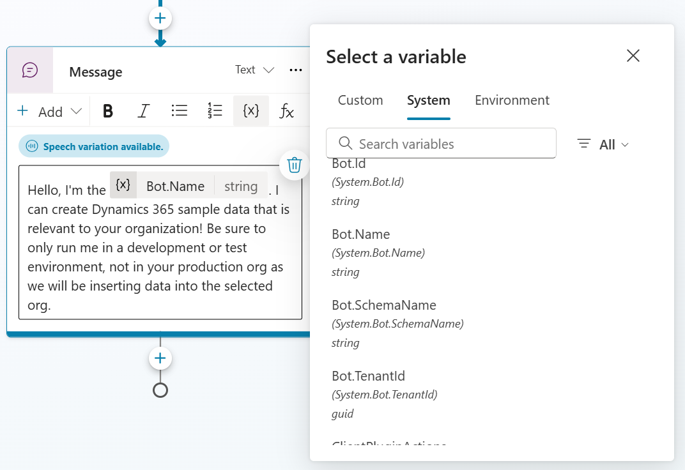
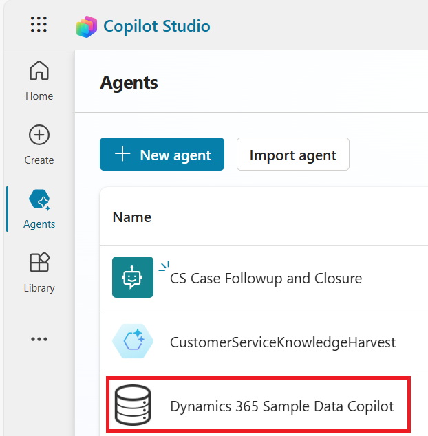
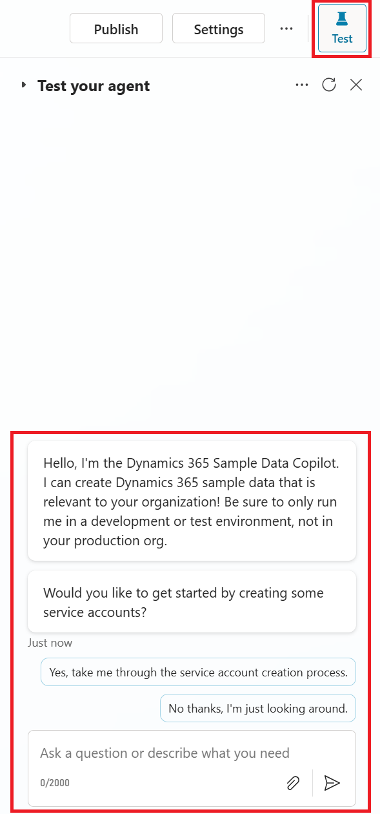

# Build an agent in Copilot Studio to create sample data in Dynamics 365 Field Service

Microsoft provides sample data in the Dynamics 365 apps that is standard across industries. As part of the onboarding process for new users or decision makers, the standard sample data can seem irrelevant to their job type, geographical location, or other factors. But with Copilot Studio, you can take advantage of generative AI and integrations with Dynamics 365 to generate sample data in locations where your organization does business.  

Start with a sample solution that we provide in the [https://github.com/microsoft/Dynamics-365-FastTrack-Implementation-Assets/](https://github.com/microsoft/Dynamics-365-FastTrack-Implementation-Assets/tree/master/Field%20Service/Component%20Library/Copilot%20Sample%20Data%20Agent/Solutions) GitHub repo. This sample data solution is intended for anyone around the world who wants to demo, test, or just play with Dynamics 365 Field Service. The agent does the work of creating data in Dynamics 365, which means the user doesn't need to know about Dynamics 365 tables and schema.

We show you how to build an agent using Copilot Studio that helps you create location-based **Account** sample data in Dynamics 365.

> [!TIP]
> Download the complete *Copilot Studio Sample Data Agent* solution from our FastTrack GitHub repro at [https://github.com/microsoft/Dynamics-365-FastTrack-Implementation-Assets/Field Service/Component Library/Copilot Sample Data Agent/Solutions](https://github.com/microsoft/Dynamics-365-FastTrack-Implementation-Assets/tree/master/Field%20Service/Component%20Library/Copilot%20Sample%20Data%20Agent/Solutions).

> [!NOTE]
> Experience with Copilot Studio can be helpful but isn't required to follow the steps in this article. There are also licensing requirements for using Copilot Studio that this article doesn't discuss.

> [!NOTE]
> We hope to help organizations get started with agents. This agent can be extended or modified to suit an organization's unique processes.

## Overview

Copilot Studio is a low-code user interface that is used to build agents. The following list outlines key components that you can build in Copilot Studio:

1. A Dataverse solution to contain all our components
1. Power Automate flows that integrate with Dynamics 365
1. An agent with topics in Copilot Studio

In this article, we walk you through creating each of these components.

## Dataverse solution

Complete the following steps to create a new solution for our Copilot agent:

1. Go to [https://copilotstudio.microsoft.com/](https://copilotstudio.microsoft.com/), and select the environment where you want to create your agent. It's the environment your Dynamics 365 org is already located in.
1. From the left menu, select **Solutions**.  
    <!-- 
    :::image type="content" source="media/fs-use-copilot-studio-create-sample-data/image1.png" alt-text="Screenshot of Solutions menu in Copilot Studio."::: -->
1. From the toolbar, select **New Solution**.
    <!-- 
    :::image type="content" source="media/fs-use-copilot-studio-create-sample-data/image2.png" alt-text="Screenshot of New Solution button in Copilot Studio."::: -->
1. Enter a display name, name, publisher, and version. For example, call your solution something like *Sample Data Copilot*.

We're now ready to add components to our solution.

## Create a flow in Power Automate

We use Power Automate to create the sample data records in Dynamics 365. In the following steps, we build our flow that takes the input from Copilot, parses it into a readable format, and imports it into Dynamics 365 to create account records.

### To create a Power Automate Flow for account records

1. Open the solution you created earlier, and then select **New** -> **Automation** -> **Cloud Flow** -> **Instant**.
    <!-- 
    :::image type="content" source="media/fs-use-copilot-studio-create-sample-data/image3.png" alt-text="Screenshot of creating a new cloud flow in Power Automate."::: -->

1. In the **Build an instant cloud flow** page, specify a name for the flow, such as *Create Accounts in Dynamics 365 Flow*, and then for how to trigger this flow, select **Run a flow from Copilot**. Then select **Create**.
    <!-- 
    :::image type="content" source="media/fs-use-copilot-studio-create-sample-data/image4.png" alt-text="Screenshot of flow creation in Power Automate."::: -->

    > [!TIP]
    > If you skip this step, you can manually add the trigger to run a flow from Copilot.

1. In the authoring canvas, select the **Skills** trigger node, and then add an input. Select **Text**, and then set the fields as indicated in the following table.

    |Title |Description  |
    |---------|---------|
    |Input|Accounts CSV |
    <!-- 
        :::image type="content" source="media/fs-use-copilot-studio-create-sample-data/image5.png" alt-text="Screenshot of adding input in Power Automate flow."::: -->

1. Choose the **New Step** icon below the **Run a flow from Copilot** trigger, select **Data Operation**, and then select **Compose**.

    :::image type="content" source="media/fs-use-copilot-studio-create-sample-data/image6.png" alt-text="Screenshot of selecting Data Operation in Power Automate.":::
    :::image type="content" source="media/fs-use-copilot-studio-create-sample-data/image7.png" alt-text="Screenshot of Compose action in Power Automate.":::

1. Select the three dots, select Rename, and then name the step *Split String to CSV*.
1. Under **Inputs**, select **Expression** to add a function, and then enter the following code:

    `slice(triggerBody()?['text'], indexOf(triggerBody()?['text'], 'Name'), length(triggerBody()?['text']))`

    :::image type="content" source="media/fs-use-copilot-studio-create-sample-data/image8.png" alt-text="Screenshot of adding expression in Power Automate.":::

    This step is now complete. Navigate back on the canvas.

1. Choose the **New Step** action, select **Data Operation**, and then select *Compose*.
1. Name the step **CSVTable**.
1. Under **Inputs**, select **Expression** to add a function and then enter the following code:

    `trim(slice(outputs('Split_String_to_CSV'), indexOf(outputs('Split_String_to_CSV'), 'Name'), indexOf(outputs('Split_String_to_CSV'), '```')))`

    This step is now complete. Navigate back on the canvas.

1. Choose the **New Step** action below this step, select **Data Operation**, and then select *Compose*.
1. Name the step **NewLine**.
1. Under Inputs, enter a new line by pressing enter.

    :::image type="content" source="media/fs-use-copilot-studio-create-sample-data/image9.png" alt-text="Screenshot of NewLine step in Power Automate.":::

    This step is now complete. Navigate back on the canvas.

1. Choose the **New Step** action below this step, select **Data Operation**, and then select *Compose*.
1. Name the step **Split CSV**.
1. Under Inputs, select **Expression** to add a function, and then enter the following code:

    `split(outputs('CSVTable'),outputs('NewLine'))`

    This step is now complete. Navigate back on the canvas.

1. Choose the **New Step** action below this step, select **Data Operation**, and then select *Compose*.
1. Name the step **Get Field Names**.
1. Under Inputs, select **Expression** to add a function, and then enter the following code:

    `split(first(outputs('Split_CSV')),',')`

    This step is now complete. Navigate back on the canvas.

1. Choose the **New Step** action below this step, select **Data Operation**, and then select *Create CSV Table*.

    :::image type="content" source="media/fs-use-copilot-studio-create-sample-data/image10.png" alt-text="Screenshot of Create CSV Table step in Power Automate.":::

1. Name the step **Map Fields**.
1. In the **From** field, enter the following formula:

    `skip(outputs('Split_CSV'),1)`

1. Set the **Columns** field to *Custom*.

    :::image type="content" source="media/fs-use-copilot-studio-create-sample-data/image11.png" alt-text="Screenshot of setting columns to custom in Power Automate.":::

1. Add rows that map headers and values in the fields under **Map Fields**.  

    > [!IMPORTANT]
    > You must select **Expression** for each formula, don't enter the formula directly into the text box.

    Create a new row for each row in the following table:

    | **Header textbox**       | **Value textbox** |
    |---------------------------------|---------------------------|
    | `outputs('Get_Field_Names')[0]`   | `split(item(), ',')[0]`     |
    | `outputs('Get_Field_Names')[1]`   | `split(item(), ',')[1]`     |
    | `outputs('Get_Field_Names')[2]`   | `split(item(), ',')[2]`     |
    | `outputs('Get_Field_Names')[3]`   | `split(item(), ',')[3]`     |
    | `outputs('Get_Field_Names')[4]`   | `split(item(), ',')[4]`     |
    | `outputs('Get_Field_Names')[5]`   | `split(item(), ',')[5]`     |
    | `outputs('Get_Field_Names')[6]`   | `split(item(), ',')[6]`     |

    This step is now complete. Navigate back on the canvas.

1. Choose the **New Step** action below this step, select **Data Operation**, and then choose **Parse JSON**.
1. Name the step **Parse JSON**.
1. In the **Content** section, add a variable, and then select **Body** from the **Map Fields** step.
1. Paste the following schema:

    ```json
    {
      "type": "array",
      "items": {
        "type": "object",
        "properties": {
          "Name": {
            "type": "string"
          },
          "Address1_Line1": {
            "type": "string"
          },
          "Address1_City": {
            "type": "string"
          },
          "Address1_StateorProvince": {
            "type": "string"
          },
          "Address1_PostalCode": {
            "type": "string"
          },
          "Address1_Latitude": {
            "type": "string"
          },
          "Address1_Longitude": {
            "type": "string"
          }
        },
        "required": [
          "Name",
          "Address1_Line1",
          "Address1_City",
          "Address1_StateorProvince",
          "Address1_PostalCode",
          "Address1_Latitude",
          "Address1_Longitude"
        ]
      }
    }
    ```

    This step is now complete. Navigate back on the canvas.

1. Choose the **New Step** action below this step, select **Microsoft Dataverse**, and then choose **Add a new row**.
1. Name the step **Add a new row**.
1. Select the **Table Name** as **Accounts**.
1. An **Apply to Each** control is applied automatically. Map the following fields:

    | **Field Name**             | **Map To (from Parse JSON)** |
    |----------------------------|------------------------------|
    | Account Name               | Name                         |
    | Address 1: Street 1        | Address1_Line1               |
    | Address 1: City            | Address1_City                |
    | Address 1: Latitude        | Address1_Latitude            |
    | Address 1: Longitude       | Address1_Longitude           |
    | Address 1: State/Province  | Address1_State               |
    | Address 1: ZIP/Postal Code | Address1_PostalCode          |

    This step is now complete. Navigate back on the canvas.

Save the Power Automate flow.

> [!TIP]
> If you create a flow outside of the solution, make sure you add it to the solution so it's visible to our Copilot Studio agent. Learn more at [Create a flow - Microsoft Copilot Studio](/microsoft-copilot-studio/advanced-flow-create#add-the-flow-to-a-solution)

## Create an agent in Copilot Studio

We'll now create our agent.

1. From the solution you created earlier, select **New** -> **Agent** -> **Agent**.
<!-- 
    :::image type="content" source="media/fs-use-copilot-studio-create-sample-data/image13.png" alt-text="Screenshot of creating a new agent in Copilot Studio."::: -->

1. You can use Copilot itself to create agents. In our example, we choose the **Skip to Configure** button in the top right corner:

    :::image type="content" source="media/fs-use-copilot-studio-create-sample-data/image14.png" alt-text="Screenshot of skipping to configure in Copilot Studio.":::

1. Provide a name and a description, and then choose the **Create** action. In this article, we call the agent *Dynamics 365 Sample Data Copilot*.

    :::image type="content" source="media/fs-use-copilot-studio-create-sample-data/image15.png" alt-text="Screenshot of naming the agent in Copilot Studio.":::

Next, we modify one of the out-of-the-box topics, [Conversation Start](#modify-the-conversation-start-topic), and create a new topic, *Create Dynamics 365 Account Sample Data*, in two different ways:

- [Create the topic with code](#create-the-topic-with-code)  
- [Create the topic manually](#create-the-topic-manually)  

## Create the topic with code

Follow these steps to create a new topic.

1. Go to the Topics tab and select Add a topic -> From blank:

    :::image type="content" source="media/fs-use-copilot-studio-create-sample-data/image16.png" alt-text="Screenshot of adding a topic from blank in Copilot Studio.":::

1. In the top left, choose the label  **Untitled**, and replace it with the name *Create Dynamics 365 Account Sample Data*.
1. Go to the **More** menu option, and then select **Open code editor**.
    <!-- 
    :::image type="content" source="media/fs-use-copilot-studio-create-sample-data/image17.png" alt-text="Screenshot of opening code editor in Copilot Studio."::: -->

1. Paste the following code into the editor:

    ```yaml
    kind: AdaptiveDialog
    beginDialog:
      kind: OnRecognizedIntent
      id: main
      intent:
        triggerQueries:
        - Create Dynamics 365 Account Records
    
      actions:
        - kind: Question
          id: question_l2NZ5B
          interruptionPolicy:
          allowInterruption: true

          variable: init:Topic.LatLongQuestion
          prompt: Sure, I can help with that. Let's start by defining a central location where our data will be based. Would you like to enter a central location or use the default location of Times Square (40.757500, -73.985830)?

          entity:
            kind: EmbeddedEntity
            definition:
              kind: ClosedListEntity
              items:
                - id: Use Times Square
                  displayName: Use Times Square
                - id: Enter my own starting place
                  displayName: Enter my own starting place
        - kind: ConditionGroup
          id: conditionGroup_8TBebf
          conditions:
            - id: conditionItem_YT2JNQ
              condition: =Topic.LatLongQuestion = 'cref4_copilotUpdateDynamics.topic.Test2.main.question_l2NZ5B'.'Use Times Square'
              actions:
                - kind: SetVariable
                  id: setVariable_cU0YkY
                  variable: Global.Latitude
                  value: "\"40.7575\""
                - kind: SetVariable
                  id: setVariable_OBsvkQ
                  variable: Global.Longitude
                  value: "\"-73.98583\""
            - id: conditionItem_XI2Wt8
              condition: =Topic.LatLongQuestion = 'cref4_copilotUpdateDynamics.topic.Test2.main.question_l2NZ5B'.'Enter my own starting place'
              actions:
                - kind: Question
                  id: question_PvLcgI
                  interruptionPolicy:
                  allowInterruption: true
                  variable: Global.Latitude
                  prompt: "OK, please enter the latitude of your starting place. It should look something like this: 40.757500"
                  entity: StringPrebuiltEntity
                - kind: Question
                  id: question_ABqb2S
                  interruptionPolicy:
                  allowInterruption: true
                  variable: Global.Longitude
                  prompt: "Now enter the longitude of your starting place. It should look something like this: -73.985830"
                  entity: StringPrebuiltEntity
        - kind: SendActivity
          id: sendActivity_MVCLUE
          activity: You got it! I'll show you the data to verify before we create it in Dynamics 365. This might take a moment.
        - kind: SearchAndSummarizeContent
          id: 0ozNLn
          displayName: Generate accounts with generative answers
          autoSend: false
          variable: Topic.AccountsCSVOutput
          userInput: "''"
          additionalInstructions: "Create a CSV format list without double quotes of 5 accounts with the following fields: fake company name = Name, fake street name and number = Address1_Line1, real city = Address1_City, real state abbreviation = Address1_StateorProvince, real zip code = Address1_PostalCode , real latitude = Address1_Latitude, real longitude = Address1_Longitude within 50 miles of {Global.Latitude}, {Global.Longitude} "
        - kind: SendActivity
          id: sendActivity_qy2BJm
          activity: "{Topic.AccountsCSVOutput}"
        - kind: Question
          id: question_rLxDXK
          interruptionPolicy:
          allowInterruption: true
          variable: init:Topic.CreateInDynamics
          prompt: Please verify the sample data. If it looks good, I can create these accounts in Dynamics 365 for you now. Do you want me to import the accounts?
          entity:
            kind: EmbeddedEntity
            definition:
              kind: ClosedListEntity
              items:
                - id: Yes, create these in Dynamics 365
                  displayName: Yes, create these in Dynamics 365
                - id: No, I don't want these created in Dynamics 365.
                  displayName: No, I don't want these created in Dynamics 365.
        - kind: ConditionGroup
          id: conditionGroup_Y9BPEq
          conditions:
            - id: conditionItem_kV0eBW
              condition: =Topic.CreateInDynamics = 'cref4_copilotUpdateDynamics.topic.Test2.main.question_rLxDXK'.'Yes, create these in Dynamics 365'
              actions:
                - kind: SendActivity
                  id: sendActivity_ZISjiE
                  activity: Account records have been created in Dynamics 365.
            - id: conditionItem_NttcFZ
              condition: =Topic.CreateInDynamics = 'cref4_copilotUpdateDynamics.topic.Test2.main.question_rLxDXK'.'No, I don''t want these created in Dynamics 365.' 
              actions: 
                - kind: SendActivity 
                  id: sendActivity_upTEZp 
                  activity: Thanks. You must create these records manually or try again. 

        elseActions: 
          - kind: SendActivity 
            id: sendActivity_YxbkmR 
            activity: Thanks. You must create these records manually or try again. 

    inputType:
      properties:
        AccountsCSVOutput:
          displayName: AccountsCSVOutput 
          type: String
    ```

1. Scroll down to the **Create Records in Dynamics Condition**, and then choose the plus sign to add a new node.   
    <!--  -->

1. Select **Call an Action**, and then select the **Create Accounts in Dynamics 365 Flow** action that we created in the previous step:  
    <!--  -->

1. For the **Input (String)** value, select the **AccountsCSVOutput** variable.  
    <!--  -->

1. Save the topic.

## Create the topic manually

The following steps are the manual equivalent of pasting the code into the editor that we did in the previous section.

> [!TIP]
> Only follow these steps if you didn't follow the steps in the [To create the topic with code](#create-the-topic-with-code) section to create the topic with AI. Continue with the steps here if you want to manually create the topic, such as to understand how each step of the topic works.

1. Select the **Topics** tab. Select **Add a Topic** then **From Blank**.

1. Under the Trigger node, add a new node **Ask a question**. In the message, enter `Sure, I can help with that. Let's start by defining a central location where our data will be based. Would you like to enter a central location or use the default location of Times Square (40.757500, -73.985830)?`

1. Select **+ New Option** and enter `Use Times Square`.

1. Select **+ New Option** and enter `Enter my own starting location`.

1. Scroll down to view the conditions automatically created from the **Ask a Question** node. Locate the condition for `Use Times Square`, and then add a new node under it, **Variable Management**-\>**Set Variable Value**. Select **Set Variable** to *Global.Latitude* and **To value** to *40.7575*.

1. Add a new node **Variable Management**-\>**Set Variable Value**. Select **Set Variable** to *Global.Longitude* and **To value** to *-73.98583*.

1. Under the **Enter my own starting place** condition, add a new node, **Ask a Question**. Set the message to `OK, please enter the latitude of your starting place. It should look something like this: 40.757500.`. Set **Identify** to *User's Entire Response*. Save the response in the variable *Global.Latitude*.

1. Add a new node **Ask a Question**. Set the message to `OK, please enter the longitude of your starting place. It should look something like this: -73.98583`. Set **Identify** to *User's Entire Response*. Save the response in the variable *Global.Longitude*.

1. After the **Conditions** nodes, add a new node **Send a Message**. The message verifies that the information is received and informs the user of what's next. The message should be `You got it! I'll show you the data to verify before we create it in Dynamics 365. This might take a moment.`

1. After the **Send a Message** node, add a new node **Advanced**-\>**Generative Answers**. For Input, enter two single quotes.  

    :::image type="content" source="media/fs-use-copilot-studio-create-sample-data/image21.png" alt-text="Screenshot of the Input field with two single quotes.":::

1. Choose the **Edit Data Sources** action. Under **Classic data**, select the box to
    **Allow the AI to use its own general knowledge** and use the following query:  

    `Create a CSV format list without double quotes of 5 accounts with the following fields: fake company name = Name, fake street name and number = Address1_Line1, real city = Address1_City, real state abbreviation = Address1_StateorProvince, real zip code = Address1_PostalCode , real latitude = Address1_Latitude, real longitude = Address1_Longitude within 50 miles of {latitude}, {longitude}`

1. Replace `{latitude}` and `{longitude}` in the example by selecting **{x}** and
    then specifying the *Global.Latitude* and *Global.Longitude* variables, respectively.

1. Under **Advanced**, check the box for **Send a message** and save the bot response as a new variable **AccountsCSVOutput** type string.

1. Under the **Generative Answers** node, create a new node and select **Ask a Question**. In the message, enter `Please verify the sample data. If it looks good, I can create these accounts in Dynamics 365 for you now. Do you want me to import the accounts?`  

    We provide two options for the user: `Yes, create these accounts in Dynamics 365` and `No, I don't want these created in Dynamics 365`. The user's response saves to a new variable called **CreateInDynamics**.

1. Using the variable from the answered question, if the answer is Yes, then select **Call an Action**, and then **Create Accounts in Dynamics 365 Flow**, which is the flow we created earlier.

1. Finally, add a node to **Send a Message**, display a message to the
    user that `Account records have been created in Dynamics 365.`

## Modify the Conversation start topic

Now, we modify the out-of-the-box *Conversation Start* topic to call the new **Create Dynamics 365 Account Sample Data** topic that we created earlier.

1. Select the **Topics** tab, then the **System** tab, and then open **Conversation Start**.
    <!-- 
     -->

1. Open the **Message** node to edit it. This is the first text that users see when they engage with the bot.
    <!-- 
     -->

1. Replace the text with the following string:

    `Hello, I'm the <Bot.Name>. I can create Dynamics 365 sample data that is relevant to your organization! Be sure to only run me in a development or test environment, not in your production org as we will be inserting data into the selected org.`

   In the text, replace `<Bot.Name>` with the variable **Bot.Name** under the variable **System** tab.
    <!-- 
     -->

1. Choose the plus sign to create a new node below the conversation start box, and then choose **Ask a question**. In the message box, enter the following text:

    `Do you want to get started by creating some service accounts?`

1. Under **Options for User**, select the **+ New Option** action, and then enter *Yes* for option 1.

1. Select **+ New Option** and enter *No* for option 2

1. Scroll down and there should be 3 condition nodes created from the **Ask a Question** node. Under the **Yes** node, add a new node, select **Topic Management**, choose **Go to Another Topic**, and then select the topic **Create Dynamics 365 Account Sample Data** that we created earlier.

> [!TIP]
> The flow should automatically add the conditions. If it doesn't, follow the manual steps to add the conditions.

## Run the agent

To run the agent:

1. In a browser tab, go to Bing Maps at [https://www.bing.com/maps/](https://www.bing.com/maps/), enter your chosen central location, and then right-click the map, and then copy the coordinates.

    For example, if you are in New York City and in Times Square, you can
    copy the coordinates (40.757500, -73.985830).
    :::image type="content" source="media/fs-use-copilot-studio-create-sample-data/image25.png" alt-text="Screenshot of the context menu for a pin in Bing Maps with the menu item Copy highlighted in yellow.":::

1. In a separate browser tab, go to Copilot Studio at [https://copilotstudio.microsoft.com/](https://copilotstudio.microsoft.com/), and then select the environment that you deployed the Copilot in the top right.

1. In the left menu, select **Agents**, then **Dynamics 365 Sample Data Copilot**.  
    <!--  -->

1. On the right, select the **Test** action, and then follow the instructions of Copilot.  
    <!--  -->

1. Follow the prompts in Copilot agent to create sample data. When prompted, enter the latitude and longitude, you copied from Bing Maps.

1. Once Copilot has generated the sample data, go to your Dynamics 365 organization and browse to **Accounts** to see the sample data created.

## Related content

- [Use Copilot to create sample data for Field Service](fs-copilot-import-sample-data.md)  
